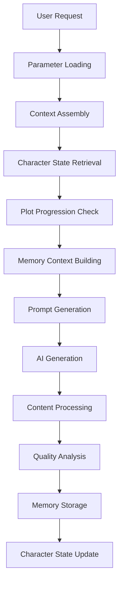

# System Data Specification - Technical Reference

## Overview

This document provides detailed technical specifications for data structures, file formats, and storage patterns used in the Novel Automation System. This serves as a reference for developers working with the system's data layer.

---

## 🏗️ Data Architecture Overview

### Directory Structure & Responsibility

```
data/
├── config/              # System configuration (YAML/JSON)
├── characters/          # Character management system
├── chapters/            # Generated content storage
├── parameters/          # Runtime parameters & templates
├── plot/               # Story structure & narrative
├── prompts/            # Generation history & debugging
├── short-term/         # 72h temporary memory
├── mid-term-memory/    # Analysis & progression data
├── long-term-memory/   # Persistent knowledge base
├── skills/             # Character ability definitions
├── world-knowledge/    # World & setting information
├── backup/             # Backup & recovery
└── diagnostics/        # System monitoring & debug
```

---

## 📊 Data Format Specifications

### 1. System Configuration Files

#### `config/system-parameters.json`
```typescript
interface SystemParameters {
  version: string;
  generation: {
    targetLength: number;
    minLength: number;
    maxLength: number;
    temperature: number;
    topP: number;
    maxRetries: number;
    timeout: number;
  };
  memory: {
    maxHistoryItems: number;
    shortTermRetention: string; // Duration format (e.g., "72h")
    summaryDetailLevel: number; // 1-10
    maxContextLength: number;
  };
  characters: {
    maxActiveCharacters: number;
    characterBleedTolerance: number; // 0.0-1.0
    defaultPersonalityDepth: number; // 1-10
  };
  plot: {
    coherenceCheckFrequency: number;
    foreshadowingDensity: number; // 0.0-1.0
    tensionManagement: boolean;
  };
  system: {
    logLevel: 'debug' | 'info' | 'warn' | 'error';
    enableCache: boolean;
    maxCacheSize: number;
  };
}
```

#### `config/world-settings.yaml`
```yaml
world:
  genre: "現代ドラマ"
  setting: "現代日本"
  tone: "リアリスティック"
  themes:
    - "成長"
    - "人間関係"
    - "挑戦"
  
technical_constraints:
  content_rating: "全年齢"
  language: "ja"
  target_audience: "一般読者"
  
narrative_elements:
  pov: "三人称"
  tense: "過去形"
  style: "自然で読みやすい文体"
```

### 2. Character System Data

#### Character Definition (`characters/main/character-{name}.yaml`)
```typescript
interface CharacterDefinition {
  basic_info: {
    name: string;
    age: number;
    gender?: string;
    occupation?: string;
    personality: string[];
    physical_description?: string;
  };
  background: {
    family?: string;
    education?: string;
    history?: string;
    relationships?: Record<string, string>;
  };
  psychological_profile: {
    motivation: string[];
    fears: string[];
    values: string[];
    speech_patterns?: string[];
  };
  skills: Record<string, number>; // Skill name -> proficiency (0-10)
  current_state: {
    mood: string;
    location?: string;
    goals: string[];
    conflicts?: string[];
  };
  narrative_role: {
    importance: 'main' | 'sub' | 'supporting' | 'background';
    arc_type?: string;
    relationships: string[];
  };
}
```

#### Character Parameters (`character-parameters/character-{name}.json`)
```typescript
interface CharacterParameters {
  characterId: string;
  lastUpdated: string; // ISO timestamp
  generation_parameters: {
    voice_consistency: number; // 0.0-1.0
    personality_strength: number; // 0.0-1.0
    dialogue_style: string;
    description_depth: number; // 1-10
  };
  behavioral_patterns: {
    decision_making: string;
    stress_response: string;
    social_interaction: string;
  };
  development_tracking: {
    growth_stage: string;
    completed_arcs: string[];
    pending_developments: string[];
  };
}
```

### 3. Memory System Data Structures

#### Short-Term Memory (`short-term/`)

**Generation Cache** (`generation-cache.json`):
```typescript
interface GenerationCache {
  lastChapter: number;
  recentCharacterStates: Record<string, CharacterState>;
  activeContext: {
    themes: string[];
    mood: string;
    location: string;
    timeframe: string;
  };
  processingMetrics: {
    avgGenerationTime: number;
    successRate: number;
    lastGenerated: string; // ISO timestamp
  };
}
```

**Chapter Data** (`chapters/chapter-{N}.json`):
```typescript
interface ChapterData {
  id: string;
  chapterNumber: number;
  title: string;
  content: string;
  metadata: {
    wordCount: number;
    characterCount: number;
    estimatedReadingTime: number;
    themes: string[];
    characters: string[];
    locations: string[];
    createdAt: string; // ISO timestamp
    lastModified: string; // ISO timestamp
  };
  analysis?: {
    qualityScore: number;
    readabilityScore: number;
    emotionalTone: string;
    pacing: number;
  };
}
```

#### Mid-Term Memory (`mid-term-memory/`)

**Analysis Results** (`analysis-results.json`):
```typescript
interface AnalysisResults {
  timestamp: string;
  chapterAnalyses: Record<number, ChapterAnalysis>;
  narrativeProgression: {
    overallPacing: number;
    tensionCurve: number[];
    themeConsistency: number;
    characterDevelopment: Record<string, number>;
  };
  qualityTrends: {
    averageQuality: number;
    qualityByChapter: Record<number, number>;
    improvementAreas: string[];
  };
}
```

**Character Evolution** (`character-evolution.json`):
```typescript
interface CharacterEvolution {
  characterId: string;
  evolutionHistory: {
    timestamp: string;
    chapterNumber: number;
    changes: {
      attribute: string;
      oldValue: any;
      newValue: any;
      reason: string;
    }[];
    developmentMilestones: string[];
  }[];
  currentTrajectory: {
    direction: 'growth' | 'decline' | 'stable';
    focusAreas: string[];
    predictedDevelopments: string[];
  };
}
```

#### Long-Term Memory (`long-term-memory/`)

**Knowledge Database** (`knowledge/characters/master-records.json`):
```typescript
interface CharacterMasterRecords {
  characters: Record<string, {
    consolidatedProfile: CharacterDefinition;
    interactionPatterns: Record<string, string>; // Other character -> relationship type
    narrativeSignificance: {
      totalAppearances: number;
      keyScenes: string[];
      characterArcs: string[];
      impactScore: number; // 0.0-1.0
    };
    learningData: {
      successfulTraits: string[];
      effectiveDialogue: string[];
      readerResponse: string[];
    };
  }>;
  relationships: {
    pairs: Record<string, RelationshipDynamics>;
    groupDynamics: GroupInteraction[];
  };
}
```

### 4. Plot & Narrative Structures

#### Plot Sections (`plot/sections/sections.json`)
```typescript
interface PlotSections {
  sections: {
    id: string;
    title: string;
    type: 'introduction' | 'development' | 'climax' | 'resolution';
    chapterRange: [number, number];
    keyEvents: string[];
    primaryCharacters: string[];
    themes: string[];
    objectives: string[];
    tensionLevel: number; // 1-10
  }[];
  transitions: {
    fromSection: string;
    toSection: string;
    transitionType: string;
    bridgeElements: string[];
  }[];
}
```

### 5. Parameter Templates & Presets

#### Parameter Template (`parameters/templates/標準設定.json`)
```typescript
interface ParameterTemplate {
  id: string;
  name: string;
  description: string;
  version: string;
  createdDate: string;
  lastModified: string;
  parameters: SystemParameters; // Same structure as system-parameters.json
  tags: string[];
  isDefault: boolean;
  compatibilityVersion: string;
}
```

---

## 🔄 Data Flow & Processing Patterns

### 1. Chapter Generation Flow



### 2. Memory System Data Flow

#### Write Operations:
1. **Short-term**: Immediate storage of generated content
2. **Mid-term**: Analysis results and progression data
3. **Long-term**: Consolidated knowledge and patterns

#### Read Operations:
1. **Context Building**: Query all tiers for relevant information
2. **Character Retrieval**: Character states from appropriate tier
3. **Plot Progression**: Recent progress from short/mid-term

### 3. Configuration Loading Priority

```
1. Environment Variables
2. data/config/system-parameters.json
3. data/parameters/user-configurations/
4. data/parameters/templates/{selected-template}.json
5. Default values (hardcoded)
```

---

## 📋 File Naming Conventions

### Standard Patterns

| Type | Pattern | Example |
|------|---------|---------|
| Character Files | `character-{name}.{ext}` | `character-sato.yaml` |
| Chapter Files | `chapter-{number}.{ext}` | `chapter-001.md` |
| Chapter Metadata | `chapter-{number}-metadata.json` | `chapter-001-metadata.json` |
| Prompt History | `prompt_chapter{N}_{timestamp}.txt` | `prompt_chapter1_2025-06-06T10-00-00-000Z.txt` |
| Backup Files | `{original}.backup.{timestamp}` | `character-sato.yaml.backup.1749016082568` |
| Relationship Files | `{char1}_{char2}.json` | `character-sato_character-suzuki.json` |
| Growth Plans | `growth-plan-{name}.json` | `growth-plan-sato.json` |

### Timestamp Format
- **Standard**: ISO 8601 format (`2025-06-06T10:00:00.000Z`)
- **File Names**: Compact format (`2025-06-06T10-00-00-000Z`)
- **Backup Suffix**: Unix timestamp (`1749016082568`)

---

## 🔒 Data Validation & Integrity

### Required Fields Validation

#### Character Files:
- `basic_info.name` (required, unique)
- `basic_info.age` (required, number)
- `skills` (required, object)
- `current_state` (required, object)

#### Chapter Files:
- `chapterNumber` (required, unique, sequential)
- `content` (required, non-empty)
- `metadata.createdAt` (required, valid timestamp)

### Data Consistency Checks

1. **Character References**: All character names referenced in chapters must exist in character definitions
2. **Chapter Sequence**: Chapter numbers must be sequential without gaps
3. **Timestamp Ordering**: Creation timestamps must be chronologically consistent
4. **Cross-Reference Integrity**: Relationships must reference existing characters

---

## 🔧 Storage Implementation Notes

### File System Requirements
- **Encoding**: UTF-8 for all text files
- **Line Endings**: LF (Unix-style)
- **Permissions**: Read/write for application, read-only for backups

### Performance Considerations
- **Indexing**: Character names and chapter numbers should be indexed
- **Caching**: Frequently accessed files should be cached in memory
- **Batch Operations**: Multiple character updates should be batched

### Backup Strategy
- **Frequency**: Automatic backup before any destructive operation
- **Retention**: Keep last 10 versions of critical files
- **Location**: `data/backup/` with timestamp subdirectories

---

## 📈 Monitoring & Metrics

### Key Metrics to Track

| Metric | Location | Update Frequency |
|--------|----------|------------------|
| Generation Success Rate | `mid-term-memory/system-statistics.json` | Per generation |
| Character Consistency Score | `mid-term-memory/quality-metrics.json` | Per chapter |
| Memory Usage | `diagnostics/memory-usage.json` | Hourly |
| File System Usage | `diagnostics/storage-metrics.json` | Daily |

### Health Check Indicators
- All required configuration files present
- No corrupted JSON/YAML files
- Character reference integrity maintained
- Memory tier sizes within expected ranges

---

*Last Updated: 2025-06-06*
*Version: 1.0*
*For: Novel Automation System v0.1.0*