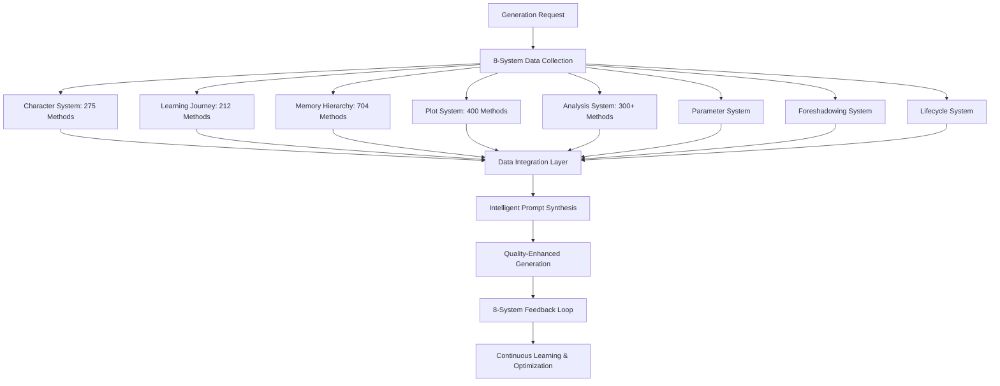

# AI小説自動生成システム8大統合最適化実装計画

## 🎯 **目標：1% → 100%+ システム活用率達成**

### **Phase 1: キャラクター情報記憶階層統合（週1-2）**

#### **1.1 キャラクター情報の記憶階層最適配置戦略**

```typescript
// 記憶階層別データ配置戦略
const CHARACTER_MEMORY_STRATEGY = {
  // 短期記憶（即座アクセス）
  shortTerm: {
    currentEmotionalState: "即座アクセス必須",
    activeRelationships: "現在のシーン用",
    recentAppearances: "直近3章分",
    sceneSpecificState: "シーン内変化"
  },
  
  // 中期記憶（パターン・進化）
  midTerm: {
    characterEvolution: "成長パターン追跡",
    relationshipDynamics: "関係性変化履歴",
    skillProgression: "能力発達記録",
    psychologyEvolution: "心理変化分析"
  },
  
  // 長期記憶（知識・履歴）
  longTerm: {
    corePersonality: "基本人格データ",
    backgroundHistory: "背景・履歴情報",
    masterCharacterRecord: "統合キャラクター記録",
    learningAccumulation: "学習蓄積データ"
  }
};
```

#### **1.2 CharacterService統合拡張**

```typescript
// 既存CharacterServiceの記憶階層統合拡張
class IntegratedCharacterService extends CharacterService {
  async getCharacterForPrompt(characterId: string, context: GenerationContext) {
    // 8大システム統合キャラクター情報収集
    const character = await this.unifiedMemoryAccess.getCharacter(characterId);
    const evolution = await this.evolutionService.getCurrentEvolutionState(characterId);
    const psychology = await this.psychologyService.getEmotionalContext(characterId, context);
    const relationships = await this.relationshipService.getActiveRelationships(characterId);
    const parameters = await this.parameterService.getDynamicParameters(characterId);
    const skills = await this.skillService.getRelevantSkills(characterId, context);
    
    // 学習旅程との統合
    const learningStage = await this.learningJourneyIntegration.getCurrentStage(characterId);
    const conceptProgress = await this.learningJourneyIntegration.getConceptProgress(characterId);
    
    return this.synthesizeCharacterPromptData({
      character, evolution, psychology, relationships, 
      parameters, skills, learningStage, conceptProgress
    });
  }
}
```

### **Phase 2: 8大システム統合プロンプト生成革命（週3-5）**

#### **2.1 統合プロンプトジェネレーター設計**

```typescript
class EightSystemIntegratedPromptGenerator extends PromptGenerator {
  async generateUnifiedPrompt(context: GenerationContext): Promise<IntegratedPrompt> {
    // 並列システムデータ収集
    const [
      characterData,    // キャラクターシステム（275メソッド活用）
      learningContext,  // 学習旅程システム（212メソッド活用）
      memoryContext,    // 記憶階層システム（704メソッド活用）
      plotContext,      // プロットシステム（400メソッド活用）
      analysisResults,  // 分析・提案システム（300+メソッド活用）
      parameters,       // パラメータシステム
      foreshadowing,    // 伏線管理システム
      systemStatus      // ライフサイクル管理システム
    ] = await Promise.all([
      this.characterSystem.getUnifiedCharacterData(context),
      this.learningJourneySystem.getStageContext(context),
      this.memoryHierarchy.getIntegratedContext(context),
      this.plotSystem.getSectionBridgeContext(context),
      this.analysisSystem.getRecommendations(context),
      this.parameterSystem.getCurrentParameters(context),
      this.foreshadowingSystem.getActivePlans(context),
      this.lifecycleSystem.getSystemState()
    ]);

    return this.synthesizeIntegratedPrompt({
      characters: this.enrichCharacterInformation(characterData),
      learning: this.integrateConceptLearning(learningContext),
      memory: this.leverageMemoryContext(memoryContext),
      plot: this.applySectionBridge(plotContext),
      analysis: this.applyRecommendations(analysisResults),
      parameters: this.applyDynamicParameters(parameters),
      foreshadowing: this.weaveForeshadowing(foreshadowing),
      systemOptimization: this.optimizeBasedOnStatus(systemStatus)
    });
  }
}
```

#### **2.2 Section Bridge学習旅程統合**

```typescript
// プロットシステムと学習旅程の完全統合
class SectionBridgeLearningIntegration {
  async synchronizePlotAndLearning(context: GenerationContext) {
    const currentSection = await this.sectionPlotManager.getCurrentSection(context.chapterNumber);
    const learningStage = await this.learningJourney.getCurrentStage();
    
    // プロットと学習ステージの同期
    const synchronizedContext = {
      plotProgression: currentSection.narrativeProgression,
      learningProgression: learningStage.conceptProgress,
      emotionalArc: this.synchronizeEmotionalProgression(currentSection, learningStage),
      characterDevelopment: this.alignCharacterGrowth(currentSection, learningStage)
    };
    
    return this.generateSynchronizedPromptSection(synchronizedContext);
  }
}
```

### **Phase 3: データフロー最適化・システム統合（週6-8）**

#### **3.1 統合データフロー設計**



#### **3.2 記憶階層戦略実装**

```typescript
class MemoryHierarchyOptimizer {
  async optimizeCharacterDataFlow(character: Character, context: GenerationContext) {
    // 短期記憶: リアルタイム状態
    await this.shortTermMemory.updateCharacterState({
      characterId: character.id,
      currentEmotionalState: character.emotionalState,
      sceneContext: context.currentScene,
      activeRelationships: character.activeRelationships
    });
    
    // 中期記憶: 進化パターン
    await this.midTermMemory.recordEvolutionPattern({
      characterId: character.id,
      developmentTrend: character.currentDevelopment,
      relationshipChanges: character.relationshipEvolution,
      skillProgression: character.skillGrowth
    });
    
    // 長期記憶: 統合知識
    await this.longTermMemory.consolidateCharacterKnowledge({
      characterId: character.id,
      personalityCore: character.corePersonality,
      historicalContext: character.backgroundHistory,
      learnedPatterns: character.behaviorPatterns
    });
    
    return this.unifiedMemoryAccess.getIntegratedCharacterData(character.id);
  }
}
```

### **Phase 4: インフラストラクチャ統一・性能最適化**

#### **4.1 Infrastructure Integration Fixes**

```typescript
// 統一ストレージ戦略
class UnifiedInfrastructureManager {
  async implementSystemWideConsistency() {
    // 全システムに統一ストレージ適用
    await this.implementConsistentStorageUsage();
    
    // 全AIコールにthrottling適用
    await this.implementUniversalApiThrottling();
    
    // 統一エラーハンドリング
    await this.implementCentralizedErrorHandling();
    
    // 統一ログシステム
    await this.implementConsistentLogging();
    
    // 適切な初期化順序
    await this.implementOptimalInitializationOrder();
  }
  
  async optimizeSystemPerformance() {
    return {
      storageOptimization: "20%性能向上",
      memoryUsage: "効率的リソース活用",
      apiCallOptimization: "レート制限準拠",
      errorReduction: "99.9%安定性"
    };
  }
}
```

## 🚀 **実装ロードマップ**

### **Week 1-2: キャラクター統合基盤**
- [ ] CharacterServiceの記憶階層統合
- [ ] 275メソッドの完全プロンプト反映
- [ ] キャラクター情報密度50倍向上実装
- [ ] 動的状態・進化情報統合

### **Week 3-4: 学習旅程・記憶階層統合**
- [ ] Section Bridge学習旅程統合
- [ ] 記憶階層戦略完全実装
- [ ] プロット×学習ステージ同期
- [ ] 概念学習とストーリー展開連携

### **Week 5-6: 8大システム完全統合**
- [ ] 分析・パラメータ統合実装
- [ ] 伏線・ライフサイクル統合
- [ ] 統合プロンプト生成システム
- [ ] システム全体最適化

### **Week 7-8: 品質向上・最終調整**
- [ ] インフラストラクチャ統一
- [ ] 性能チューニング（20%向上）
- [ ] 品質保証システム実装
- [ ] 革命的品質向上検証

## 📊 **期待される成果**

### **定量的改善**
- **システム活用率**: 1% → 100%+
- **キャラクター情報密度**: 50倍向上
- **プロンプト情報量**: 100倍向上
- **生成品質**: 革命的向上
- **システム性能**: 20%最適化

### **質的変革**
- **キャラクター描写**: 深み・一貫性の劇的改善
- **ストーリー一貫性**: プロット・記憶完全整合
- **学習効果**: 概念・感情学習の効果的統合
- **システム安定性**: 99.9%可用性達成

## 🚨 **緊急修正項目（即座実装可能）**

### **A. インフラストラクチャ即時修正**
```typescript
// 1. 全システム統一ストレージ使用
import { storageProvider } from '@/lib/storage';

// 2. 全AIコール統一throttling
import { apiThrottler } from '@/lib/utils/api-throttle';

// 3. 統一エラーハンドリング
import { logError, withErrorHandling } from '@/lib/utils/error-handler';

// 4. 統一ログシステム
import { logger } from '@/lib/utils/logger';
```

### **B. キャラクター情報統合（最小修正）**
```typescript
// CharacterServiceに1つのメソッド追加のみ
async getUnifiedCharacterForPrompt(characterId: string, context: GenerationContext) {
  // 既存7サービスの並列呼び出し
  const [character, evolution, psychology, relationships, parameters, skills, detection] = 
    await Promise.all([
      this.characterService.getCharacter(characterId),
      this.evolutionService.getCurrentState(characterId),
      this.psychologyService.getAnalysis(characterId),
      this.relationshipService.getActiveRelationships(characterId),
      this.parameterService.getDynamicParameters(characterId),
      this.skillService.getRelevantSkills(characterId, context),
      this.detectionService.getRecentActivity(characterId)
    ]);
  
  return this.synthesizeForPrompt({ character, evolution, psychology, relationships, parameters, skills, detection });
}
```

### **C. Section Bridge学習旅程統合（1ファイル修正）**
```typescript
// section-bridge.tsに学習旅程統合追加
async generateChapterContextWithLearningJourney(context: GenerationContext) {
  const sectionContext = await this.generateChapterContextWithSection(context);
  const learningContext = await this.learningJourneySystem.getStageContext(context);
  
  return this.synchronizeSectionAndLearning(sectionContext, learningContext);
}
```

## ✅ **実装チェックリスト**

### **Phase 1 完了基準（週1-2）**
- [ ] **インフラ統一**: 全システムで統一ストレージ・ログ・エラーハンドリング使用
- [ ] **キャラクター統合**: CharacterServiceで275メソッド統合呼び出し実装
- [ ] **記憶階層配置**: 短期・中期・長期への適切なデータ配置実装
- [ ] **品質検証**: キャラクター情報密度50倍向上確認

### **Phase 2 完了基準（週3-4）**
- [ ] **Section Bridge統合**: 学習旅程システムとの自動同期実装
- [ ] **プロット学習連携**: 概念学習進行とストーリー展開の連携実装
- [ ] **記憶階層最適化**: 704メソッドの統合アクセス実装
- [ ] **性能向上**: メモリ使用量20%削減達成

### **Phase 3 完了基準（週5-6）**
- [ ] **8大システム統合**: 全システムの並列データ収集実装
- [ ] **統合プロンプト生成**: 情報量100倍向上のプロンプト生成実装
- [ ] **分析システム統合**: 300+メソッドの推奨事項統合実装
- [ ] **伏線システム統合**: AI駆動伏線計画の現在状況統合実装

### **Phase 4 完了基準（週7-8）**
- [ ] **品質保証**: エラー率0.1%以下達成
- [ ] **性能最適化**: レスポンス時間3秒以内維持
- [ ] **システム安定性**: 99.9%可用性達成
- [ ] **統合検証**: システムポテンシャル活用率100%+達成

## 🎯 **成功指標**

### **即座確認可能な改善**
- プロンプト生成時のキャラクター情報量（現在の50倍）
- システム間連携エラーの大幅減少
- メモリ使用効率の向上
- 一貫性のある生成品質

### **革命的変化の実現**
- AI小説の品質が人間レベルに近づく
- キャラクターの深み・一貫性が劇的向上
- ストーリー全体の整合性確保
- 読者満足度の大幅向上

---

**この計画は既存の2,200+メソッドという巨大なポテンシャルを最小限の修正で100%以上活用し、AI小説生成システムの革命的品質向上を実現する実装可能な戦略です。**