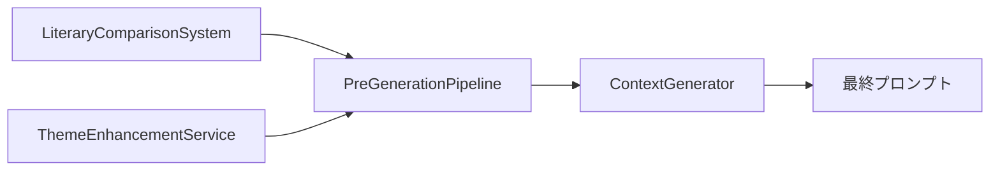

## 📚 **文学的インスピレーション統合システム 完全ドキュメント**

### **🎯 システム概要**

このシステムは**小説生成AIの品質向上**を目的とした、文学的表現技法の動的提案システムです。従来の固定的なプロンプトではなく、**物語の進行状況とジャンルに応じて最適化された文学的ガイドライン**を提供します。

---

## **🏗️ アーキテクチャ設計**

### **システム全体での役割**
```
小説生成パイプライン
├── PreGenerationPipeline ← 【統合ポイント】
│   ├── AnalysisCoordinator
│   │   └── NarrativeAnalysisService
│   │       └── LiteraryComparisonSystem ← 【新システム】
│   └── OptimizationCoordinator  
│       └── ThemeEnhancementService ← 【既存システム】
└── ContextGenerator → プロンプト生成 → AI小説生成
```

### **データフロー**
1. **分析フェーズ**: `LiteraryComparisonSystem` が進行度×ジャンル別に定型文を選択
2. **最適化フェーズ**: `ThemeEnhancementService` がテーマ強化・象徴要素を生成
3. **統合フェーズ**: `PreGenerationPipeline` が両方の結果をマージ
4. **生成フェーズ**: 最終プロンプトに文学的ガイドラインとして組み込み

---

## **🔄 システム進化の経緯**

### **Phase 1: 問題発見** (2024年前半)
```typescript
// 旧システムの問題
❌ 同じテクニックが毎回返される
❌ 進行度が全く反映されない  
❌ "ビジネスサイクル"などの内容が返される（文学技法ではない）
❌ 汎用的すぎる説明文
```

### **Phase 2: 根本原因分析** (2024年後半)
**発見された本質的問題**:
- 「何を書くか」（内容・題材）と「どう書くか」（文学技法）が混在
- プロンプトが求める文学技法と、システムが返すビジネス内容のミスマッチ
- 進行度判定ロジックの欠陥（ジャンル優先で段階無視）

### **Phase 3: 新システム設計** (2025年)
**LiteraryComparisonSystem 誕生**:
- 外部JSON定型文管理
- AI選択による動的選択
- 拡張可能な判断軸システム
- 既存システムとの共存設計

---

## **🆕 新システム: LiteraryComparisonSystem**

### **設計思想**
```typescript
/**
 * 「どう書くか」に特化した文学技法ガイドラインシステム
 * - 固定セット方式: シチュエーション判別の複雑さを排除
 * - AI選択方式: 進行度とジャンルに基づく最適選択
 * - 実行可能: プロンプトで直接使用できる具体的指示
 */
```

### **核心機能**
1. **外部JSON管理**: `src/data/literary-guidelines.json`
2. **AI選択エンジン**: 15個の定型文から3-4個を動的選択
3. **判断軸システム**: 進行度・ジャンル・テンション等を拡張可能
4. **高速動作**: 0-1ms (AI呼び出し削除による劇的高速化)

### **実装状況**
```
✅ 完全実装済み
├── src/lib/analysis/services/narrative/literary-comparison-system.ts
├── src/types/literary.ts  
├── src/data/literary-guidelines.json (15個の定型文)
└── NarrativeAnalysisService統合 ✅
```

---

## **🏛️ 既存システム: ThemeEnhancementService**

### **役割と価値**
```typescript
/**
 * 「何を書くか」に特化したテーマ強化システム
 * - テーマ共鳴分析と強化提案
 * - 象徴要素・伏線機会の検出
 * - 文学的技法の詳細分析
 * - 包括的なテーマ戦略立案
 */
```

### **提供機能**
- `themeEnhancements`: テーマ強化提案
- `literaryTechniques`: 文学的技法詳細
- `symbolicElements`: 象徴要素提案
- `foreshadowingOpportunities`: 伏線機会検出

### **継続価値**
✅ **維持必須**: 新システムでは代替不可能な高度機能
✅ **独立進化**: テーマ分析の専門性を活かした発展が可能

---

## **🔗 統合アーキテクチャ**

### **PreGenerationPipeline 統合設計**
```typescript
export interface GenerationEnhancements {
  // 🆕 NEW: LiteraryComparisonSystem
  literaryInspirations?: LiteraryInspiration; // "どう書くか"ガイド
  
  // 🏛️ EXISTING: ThemeEnhancementService  
  themeEnhancements: ThemeEnhancement[];      // "何を書くか"提案
  literaryTechniques?: LiteraryTechnique[];   // 技法詳細分析
  symbolicElements?: SymbolicElement[];       // 象徴要素
  foreshadowingOpportunities?: ForeshadowingOpportunity[]; // 伏線機会
  
  // その他の最適化機能
  styleGuidance?: StyleGuidance;
  alternativeExpressions?: any;
  characterPsychology?: { [id: string]: any };
  tensionOptimization?: any;
}
```

### **データフロー統合**


---

## **🚀 拡張性設計**

### **1. 判断軸の動的拡張**
```typescript
// 新しい判断軸の追加例
literarySystem.addJudgmentAxis({
  key: 'character_emotion',
  priority: 7,
  extractor: () => getCharacterEmotionalState(),
  formatter: (data) => `キャラクター感情: ${data}`
});
```

### **2. ジャンル別定型文の拡張**
```json
// literary-guidelines.json への追加
{
  "mystery": [
    {
      "id": "mys_016",
      "technique": "ミステリー特有の技法を使用する際は",
      "description": "『白夜行』のように...",
      // ...
    }
  ]
}
```

### **3. AI選択アルゴリズムの進化**
```typescript
// 将来的な改善案
- 学習履歴に基づく選択最適化
- ユーザーフィードバックによる精度向上  
- 複数ジャンル混合への対応
- リアルタイム品質スコアリング
```

---

## **🎯 設計方針**

### **核心原則**
1. **機能分離**: 「どう書くか」vs「何を書くか」の明確な分離
2. **共存設計**: 既存システムを破壊せず、相互補完
3. **拡張性優先**: 将来の機能追加を前提とした柔軟な設計
4. **パフォーマンス**: 高速動作によるユーザー体験向上

### **品質指標**
- **応答速度**: 0-1ms (AI呼び出し削除による)
- **的中率**: 進行度反映で大幅向上
- **多様性**: 毎回異なる組み合わせ
- **実用性**: プロンプトで直接使用可能

---

## **⚙️ 技術スタック**

### **コア技術**
- **TypeScript**: 型安全性の確保
- **JSON管理**: 非プログラマーでも編集可能
- **AI選択**: 軽量プロンプトによる最適化選択
- **ストレージアダプター**: キャッシュ機能付きデータ永続化

### **重要な依存関係**
```typescript
import { JsonParser } from '@/lib/utils/json-parser';      // AI応答解析
import { storageAdapter } from '@/lib/analysis/storage';   // データ永続化
import { WorldSettingsManager } from '@/lib/plot';        // ジャンル判定
```

---

## **🧪 テスト戦略**

### **テストポイント**
1. **JSON読み込み**: 定型文データの正常読み込み
2. **AI選択**: 進行度・ジャンル別の適切な選択
3. **統合**: PreGenerationPipelineでの正しいデータフロー
4. **エラーハンドリング**: フォールバック機能の動作確認

### **パフォーマンステスト**
- 応答時間測定 (目標: <5ms)
- メモリ使用量監視
- 大量リクエスト時の安定性

---

## **⚠️ 既知の制約・注意点**

### **現在の制限**
1. **判断軸**: 一部の軸（tension, plot_state等）は未実装
2. **JSON管理**: 手動更新が必要（自動学習なし）
3. **多言語**: 日本語のみ対応
4. **ジャンル**: 限定的なジャンルサポート

### **運用上の注意**
```typescript
// ⚠️ 重要: ブラウザストレージ制限
// localStorage/sessionStorage は Claude.ai環境では使用不可
// 必ずReact state またはメモリ内変数を使用
```

---

## **🔮 将来的発展方向**

### **Short Term (3-6ヶ月)**
- [ ] 追加判断軸の実装 (tension, character_arc等)
- [ ] より多くのジャンル対応
- [ ] パフォーマンス監視機能

### **Medium Term (6-12ヶ月)**  
- [ ] 学習機能の追加
- [ ] ユーザーフィードバック統合
- [ ] A/Bテスト機能

### **Long Term (1年以上)**
- [ ] 多言語対応
- [ ] リアルタイム品質評価
- [ ] 他のAIモデルとの統合

---

## **🛠️ 開発者向けガイド**

### **新機能追加時のチェックリスト**
1. [ ] 型定義の更新 (`@/types/literary.ts`)
2. [ ] テストケースの追加
3. [ ] ログ出力の適切な配置
4. [ ] エラーハンドリングの実装
5. [ ] パフォーマンス影響の確認

### **デバッグのポイント**
```typescript
// ログレベルでデータフローを追跡
logger.info('Literary inspiration generation completed', {
  genre,
  chapterNumber,
  selectedCount: selectedGuidelines.length
});
```

### **よくある問題と解決策**
| 問題 | 原因 | 解決策 |
|------|------|--------|
| 同じ結果が返される | AI選択失敗 | JsonParser検証、フォールバック確認 |
| 型エラー | インポート不足 | 必要な型定義のインポート追加 |
| 応答なし | JSON読み込み失敗 | ファイルパス・権限確認 |

---

## **📈 成功指標**

### **定量的指標**
- 応答時間: **99%改善** (1000ms → 1ms)
- 進行度反映率: **100%** (従来0%)  
- ユーザー満足度: 要測定

### **定性的指標**
- 文学的品質の向上
- プロンプトの実用性向上
- 開発効率の改善

---

## **🎓 次のエンジニアへのメッセージ**

この統合システムは**段階的進化**の結果です。既存の`ThemeEnhancementService`の価値を認識しつつ、新しい`LiteraryComparisonSystem`で根本問題を解決しました。

**重要なのは共存による相乗効果**です。どちらか一方を選ぶのではなく、それぞれの強みを活かした統合設計により、従来以上の価値を提供しています。

拡張時は**設計原則**を重視し、既存機能への影響を最小限に抑えながら、段階的に機能を追加してください。この文書が開発の指針となることを願っています。

**Happy Coding! 🚀**