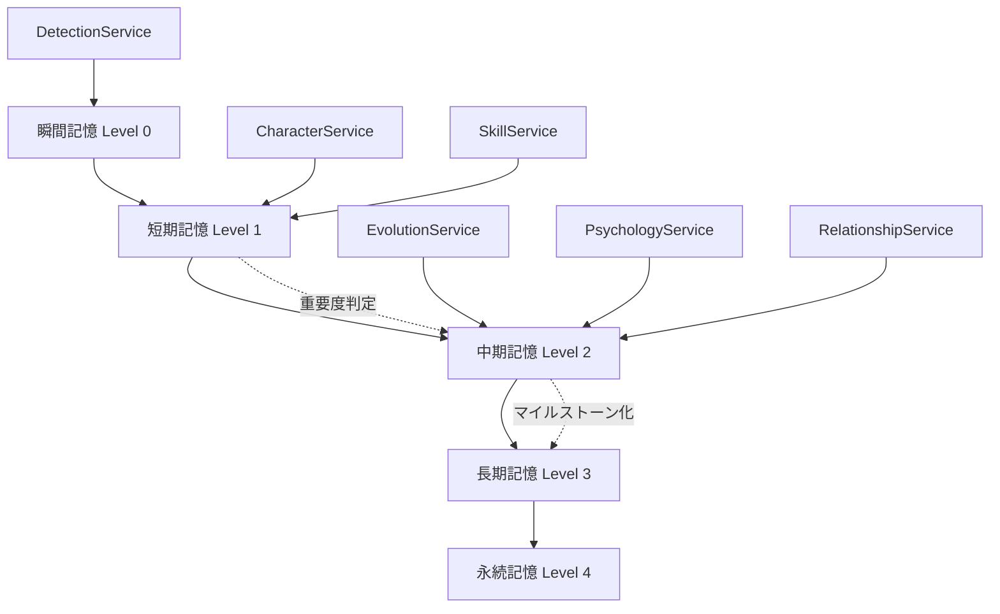

# キャラクターマネージャー最適化計画書（改訂版）

## 1. プロジェクト概要

### 1.1 目的
既存のキャラクターマネージャーシステムを新しい記憶階層システムに完全統合し、パフォーマンスと一貫性を大幅に向上させる。従来の保存方法は廃止し、混乱を避けるため完全に新システムに移行する。

### 1.2 既存システム分析結果
- **CharacterService**: キャラクターCRUD、発展処理、状態管理、イベントバス連携
- **DetectionService**: 高度な文脈検出、台詞抽出、インタラクション分析
- **EvolutionService**: 発展段階評価、成長計画管理、変容アーク、マイルストーン予測
- **ParameterService**: パラメータ初期化・更新、ジャンル別管理
- **PsychologyService**: Gemini API活用の心理分析、行動予測、感情シミュレーション
- **RelationshipService**: 関係性管理、クラスター検出、対立分析、発展追跡
- **SkillService**: スキル習得・レベル管理、習熟度システム、要件チェック

## 2. 記憶階層統合アーキテクチャ

### 2.1 記憶階層レベル定義

#### Level 0: 瞬間記憶 (Immediate Memory)
- **保存期間**: 現在処理中のコンテンツのみ
- **データ**: 現在分析中の台詞、検出されたキャラクター、リアルタイム感情状態
- **アクセス**: 超高速（メモリ内）

#### Level 1: 短期記憶 (Short-term Memory)  
- **保存期間**: 現在の章（チャプター）
- **データ**: 章内登場記録、章内インタラクション、一時的な感情変化、検出履歴
- **アクセス**: 高速（Redis/メモリキャッシュ）

#### Level 2: 中期記憶 (Medium-term Memory)
- **保存期間**: 最近5-10章
- **データ**: 発展段階変化、関係性変動、スキル習得履歴、心理状態変遷
- **アクセス**: 中速（インデックス付きDB）

#### Level 3: 長期記憶 (Long-term Memory)
- **保存期間**: キャラクター生涯
- **データ**: 基本プロフィール、重要な発展マイルストーン、確立した関係性、習得スキル
- **アクセス**: 標準（主要DB）

#### Level 4: 永続記憶 (Persistent Memory)
- **保存期間**: システム全体
- **データ**: キャラクター定義、スキル定義、パラメータ定義、関係性タイプ定義
- **アクセス**: 読み取り専用（設定ファイル/静的DB）

### 2.2 統合メモリマネージャー

```typescript
interface MemoryLayerManager {
  // 階層間自動移行
  promoteMemory(data: any, fromLevel: number, toLevel: number): Promise<void>
  demoteMemory(data: any, fromLevel: number, toLevel: number): Promise<void>
  
  // 階層横断検索
  searchAcrossLayers<T>(query: SearchQuery): Promise<LayeredResult<T>>
  
  // 自動アーカイブ
  archiveOldMemories(threshold: ArchiveThreshold): Promise<ArchiveResult>
  
  // 一貫性保証
  ensureConsistency(entityId: string): Promise<ConsistencyReport>
}
```

## 3. サービス統合最適化

### 3.1 CharacterService 最適化

#### 既存機能の記憶階層統合
```typescript
class OptimizedCharacterService {
  // 基本CRUD → 階層別データ管理
  async createCharacter(data: CharacterData): Promise<Character> {
    // Level 4: 基本定義保存
    // Level 3: プロフィール保存  
    // Level 1: 作成イベント記録
  }
  
  // 登場記録 → 自動階層振り分け
  async recordAppearance(id: string, chapterNumber: number, summary: string): Promise<Character> {
    // Level 1: 章内登場記録
    // Level 2: 登場パターン分析
    // Level 3: 重要登場のマイルストーン化
  }
  
  // 発展処理 → 段階的記憶移行
  async processCharacterDevelopment(id: string, events: ChapterEvent[]): Promise<Character> {
    // 既存のEvolutionServiceとの連携を記憶階層化
    // 発展段階に応じてLevel 2→3へ自動昇格
  }
  
  // 新機能: 記憶階層最適化
  async optimizeCharacterMemory(id: string): Promise<MemoryOptimizationResult>
  async consolidateCharacterData(id: string): Promise<ConsolidationResult>
}
```

### 3.2 DetectionService 強化

#### 文脈検出の記憶階層活用
```typescript
class OptimizedDetectionService {
  // 既存の高度検出 + 記憶活用
  async detectCharactersInContent(content: string): Promise<Character[]> {
    // Level 0: リアルタイム検出キャッシュ
    // Level 1: 章内検出履歴参照
    // Level 2: 最近の検出パターン学習
    // Level 3: 確立した検出ルール適用
  }
  
  // 台詞抽出の精度向上
  async extractCharacterDialog(character: Character, content: string): Promise<EnhancedDialog[]> {
    // Level 1-2の過去台詞パターンで精度向上
    // 検出した台詞の自動分類（重要度、感情等）
  }
  
  // インタラクション検出の高度化
  async detectInteractions(content: string): Promise<DetailedInteraction[]> {
    // 関係性履歴（Level 2-3）を活用した文脈理解
    // インタラクションの自動重要度判定
  }
  
  // 新機能: 学習型検出
  async learnDetectionPatterns(characterId: string): Promise<LearningResult>
  async adaptDetectionToGenre(genre: string): Promise<AdaptationResult>
}
```

### 3.3 EvolutionService 高度化

#### 発展管理の記憶階層最適化
```typescript
class OptimizedEvolutionService {
  // 既存の発展処理 + 階層管理
  async processCharacterDevelopment(character: Character, events: ChapterEvent[]): Promise<CharacterDevelopment> {
    // Level 1: 即座の発展要因分析
    // Level 2: 中期発展パターン評価
    // Level 3: 長期発展アーク管理
  }
  
  // 成長計画の動的最適化
  async optimizeGrowthPlan(characterId: string): Promise<OptimizedGrowthPlan> {
    // Level 2-3の履歴から最適な成長パスを算出
    // 成長速度とバランスの自動調整
  }
  
  // マイルストーン予測の精度向上
  async predictNextMilestone(characterId: string): Promise<EnhancedMilestonePrediction> {
    // 全階層のデータを活用した高精度予測
    // 複数シナリオの予測と確率計算
  }
  
  // 変容アークの動的管理
  async manageTransformationArcs(characterId: string): Promise<ArcManagementResult> {
    // アークの進行状況をLevel 2で追跡
    // Level 3での重要な変容点記録
  }
}
```

### 3.4 PsychologyService AI強化

#### Gemini API活用の最適化
```typescript
class OptimizedPsychologyService {
  // 心理分析の記憶階層統合
  async analyzeCharacterPsychology(character: Character, recentEvents: any[]): Promise<CharacterPsychology> {
    // Level 1: 最新の心理状態
    // Level 2: 心理変遷パターン
    // Level 3: 確立した心理プロフィール
    // Gemini APIの呼び出し最適化（階層データ活用で精度向上）
  }
  
  // 関係性心理の動的分析
  async analyzeRelationshipPsychology(characters: Character[]): Promise<RelationshipPsychologyMatrix> {
    // 関係性履歴（Level 2-3）を活用した心理的態度分析
    // 集団心理の分析機能追加
  }
  
  // 行動予測の高度化
  async predictBehaviors(character: Character, psychology: CharacterPsychology, situations: string[]): Promise<BehaviorPredictionMatrix> {
    // 過去の行動パターン（Level 2-3）を学習
    // 複数シナリオでの行動確率計算
  }
  
  // 新機能: 心理発展追跡
  async trackPsychologicalDevelopment(characterId: string): Promise<PsychologyEvolutionReport>
  async predictPsychologicalCrisis(characterId: string): Promise<CrisisPrediction>
}
```

### 3.5 RelationshipService ネットワーク分析

#### 関係性管理の高度化
```typescript
class OptimizedRelationshipService {
  // 関係性更新の階層管理
  async updateRelationship(char1Id: string, char2Id: string, type: string, strength: number): Promise<void> {
    // Level 1: 即座の関係性変化
    // Level 2: 関係性変動履歴
    // Level 3: 確立した関係性パターン
  }
  
  // 関係性ネットワーク分析
  async analyzeRelationshipNetwork(): Promise<NetworkAnalysisResult> {
    // 全階層のデータを活用したネットワーク分析
    // 影響力、媒介性、クラスター係数の計算
  }
  
  // 関係性予測システム
  async predictRelationshipEvolution(char1Id: string, char2Id: string): Promise<RelationshipEvolutionPrediction> {
    // Level 2-3の履歴から関係性の未来予測
    // 複数要因を考慮した発展シナリオ
  }
  
  // 新機能: 関係性最適化
  async optimizeRelationshipDynamics(): Promise<OptimizationSuggestions>
  async detectRelationshipAnomaly(): Promise<AnomalyReport>
}
```

### 3.6 SkillService 習得システム

#### スキル管理の記憶階層統合
```typescript
class OptimizedSkillService {
  // スキル習得の段階管理
  async acquireSkill(characterId: string, skillId: string, forced: boolean): Promise<SkillAcquisitionResult> {
    // Level 1: 習得プロセス記録
    // Level 2: 習得パターン分析
    // Level 3: 確立したスキルセット
  }
  
  // 習熟度システムの最適化
  async optimizeProficiencyGrowth(characterId: string): Promise<ProficiencyOptimization> {
    // Level 2の使用履歴から最適な成長カーブを計算
    // 個人差とジャンル特性を考慮
  }
  
  // スキル推薦システム
  async recommendSkills(characterId: string): Promise<SkillRecommendation[]> {
    // Level 2-3のデータから最適なスキルを推薦
    // キャラクター発展段階とストーリー要求を考慮
  }
  
  // 新機能: スキルシナジー分析
  async analyzeSkillSynergy(characterId: string): Promise<SynergyAnalysis>
  async predictSkillEvolution(characterId: string, skillId: string): Promise<SkillEvolutionPath>
}
```

## 4. データフロー最適化

### 4.1 階層間データフロー



### 4.2 自動データ移行ルール

#### 昇格ルール (Level上げ)
- **Level 0→1**: 検出確定、処理完了
- **Level 1→2**: 章終了、重要度閾値超過
- **Level 2→3**: マイルストーン達成、確立パターン認識
- **Level 3→4**: システム設定昇格

#### 降格ルール (Level下げ)
- **アクセス頻度**: 30日未アクセスで1レベル降格
- **重要度低下**: 分析結果により自動降格
- **容量制限**: Level別容量制限による自動アーカイブ

## 5. パフォーマンス最適化

### 5.1 キャッシュ戦略

#### 統合キャッシュシステム
```typescript
interface UnifiedCacheManager {
  // レベル別キャッシュ
  L0Cache: MemoryCache;     // 瞬間記憶用
  L1Cache: RedisCache;      // 短期記憶用  
  L2Cache: IndexedDBCache;  // 中期記憶用
  L3Cache: DatabaseCache;   // 長期記憶用
  
  // 階層横断キャッシュ
  crossLayerGet<T>(key: string): Promise<T | null>;
  crossLayerSet<T>(key: string, value: T, ttl?: number): Promise<void>;
  
  // インテリジェント予測キャッシュ
  prefetchRelatedData(entityId: string): Promise<void>;
}
```

### 5.2 検索・インデックス最適化

#### 階層別インデックス戦略
- **Level 0-1**: ハッシュインデックス（高速アクセス）
- **Level 2**: 複合インデックス（時系列 + 重要度）
- **Level 3**: 全文検索インデックス（Elasticsearch）
- **Level 4**: 定義参照インデックス（読み取り専用）

### 5.3 並行処理最適化

#### 非同期処理パイプライン
```typescript
class AsyncProcessingPipeline {
  // 並行分析処理
  async processCharacterAnalysis(characterId: string): Promise<AnalysisResult> {
    const [psychology, relationships, skills, evolution] = await Promise.all([
      this.psychologyService.analyze(characterId),
      this.relationshipService.analyze(characterId), 
      this.skillService.analyze(characterId),
      this.evolutionService.analyze(characterId)
    ]);
    
    return this.consolidateAnalysis(psychology, relationships, skills, evolution);
  }
  
  // バッチ処理最適化
  async batchProcessCharacters(characterIds: string[]): Promise<BatchResult>
}
```

## 6. イベントシステム最適化

### 6.1 階層化イベントバス

#### レベル別イベント配信
```typescript
interface LayeredEventBus {
  // 瞬間イベント（Level 0-1）
  publishImmediate(event: ImmediateEvent): void;
  
  // 短期イベント（Level 1-2）  
  publishShortTerm(event: ShortTermEvent): Promise<void>;
  
  // 長期イベント（Level 2-3）
  publishLongTerm(event: LongTermEvent): Promise<void>;
  
  // クロスレイヤーイベント
  publishCrossLayer(event: CrossLayerEvent): Promise<void>;
}
```

### 6.2 イベント集約とパターン検出

#### インテリジェントイベント処理
- **リアルタイム集約**: Level 0-1イベントの即座集約
- **パターン認識**: Level 2でのイベントパターン学習
- **予測イベント**: 過去パターンからの未来イベント予測

## 7. 新機能追加

### 7.1 AI駆動キャラクター分析

#### GPT-4/Gemini統合分析エンジン
```typescript
class AIAnalysisEngine {
  // 総合キャラクター分析
  async comprehensiveAnalysis(characterId: string): Promise<ComprehensiveAnalysis> {
    // 全階層データを統合してAI分析
    // 矛盾検出、発展提案、ストーリー適合性評価
  }
  
  // キャラクター一貫性チェック
  async checkCharacterConsistency(characterId: string): Promise<ConsistencyReport>
  
  // ストーリー適合性評価  
  async evaluateStoryFit(characterId: string, storyContext: string): Promise<FitScore>
}
```

### 7.2 動的バランス調整

#### 自動バランシングシステム
```typescript
class DynamicBalancer {
  // キャラクター能力バランス
  async balanceCharacterAbilities(characterId: string): Promise<BalanceAdjustment>
  
  // 関係性バランス
  async balanceRelationshipNetwork(): Promise<NetworkBalance>
  
  // ストーリー参加度バランス
  async balanceStoryParticipation(): Promise<ParticipationBalance>
}
```

### 7.3 予測分析システム

#### 未来状態予測
```typescript
class PredictiveAnalytics {
  // キャラクター発展予測
  async predictCharacterEvolution(characterId: string, chapters: number): Promise<EvolutionPrediction>
  
  // 関係性発展予測
  async predictRelationshipChanges(timeframe: number): Promise<RelationshipForecast>
  
  // ストーリー影響予測
  async predictStoryImpact(proposedChange: Change): Promise<ImpactAnalysis>
}
```

## 8. 実装フェーズ

### Phase 1: コア記憶階層実装 (4週間)
1. **Week 1**: MemoryLayerManager基盤構築
2. **Week 2**: 階層間データ移行システム実装
3. **Week 3**: 統合キャッシュシステム構築
4. **Week 4**: 基本CRUD操作の階層化

### Phase 2: サービス統合最適化 (6週間)
1. **Week 1-2**: CharacterService + DetectionService最適化
2. **Week 3-4**: EvolutionService + PsychologyService最適化  
3. **Week 5-6**: RelationshipService + SkillService最適化

### Phase 3: 高度機能実装 (4週間)
1. **Week 1-2**: AI分析エンジン統合
2. **Week 3**: 動的バランス調整システム
3. **Week 4**: 予測分析システム

### Phase 4: 最適化・テスト (2週間)
1. **Week 1**: パフォーマンス最適化
2. **Week 2**: 統合テスト・品質保証

## 9. 品質保証・テスト戦略

### 9.1 階層別テスト
- **Level 0-1**: リアルタイム処理テスト
- **Level 2-3**: データ整合性テスト  
- **Cross-Layer**: 階層間移行テスト

### 9.2 パフォーマンステスト
- **レスポンス時間**: 各階層での応答性能測定
- **スループット**: 並行処理性能評価
- **メモリ使用量**: 階層別メモリ効率測定

### 9.3 AI分析品質テスト
- **精度評価**: AI分析結果の精度測定
- **一貫性評価**: 複数回分析の結果一貫性
- **学習効果**: 時間経過による精度向上測定

## 10. 監視・運用

### 10.1 階層別監視
```typescript
interface LayeredMonitoring {
  // パフォーマンス監視
  monitorLayerPerformance(): Promise<PerformanceMetrics>;
  
  // データ整合性監視
  monitorDataConsistency(): Promise<ConsistencyMetrics>;
  
  // 容量監視
  monitorStorageUsage(): Promise<StorageMetrics>;
  
  // AI分析監視
  monitorAIAnalysisQuality(): Promise<QualityMetrics>;
}
```

### 10.2 自動運用機能
- **自動スケーリング**: 負荷に応じた階層別リソース調整
- **自動最適化**: 使用パターンに基づく自動チューニング
- **異常検出**: パフォーマンス・データ異常の自動検出

## 11. 成功指標 (KPI)

### 11.1 パフォーマンス指標
- **応答時間**: 90%ile < 100ms (Level 0-1), < 500ms (Level 2-3)
- **スループット**: 現在の10倍向上
- **メモリ効率**: 40%メモリ使用量削減

### 11.2 品質指標
- **データ整合性**: 99.9%以上
- **AI分析精度**: 85%以上の一貫性
- **システム可用性**: 99.95%以上

### 11.3 機能指標
- **検出精度**: キャラクター検出精度95%以上
- **予測精度**: 発展予測的中率80%以上
- **処理効率**: バッチ処理時間50%短縮

この最適化により、キャラクターマネージャーは新しい記憶階層システムと完全統合され、大幅なパフォーマンス向上と機能拡張を実現します。従来システムとの互換性は完全に排除し、新アーキテクチャに統一することで、保守性と拡張性を最大化します。