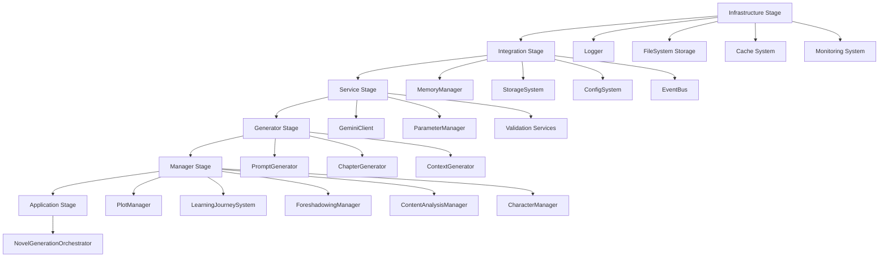

# AI小説生成システム - 統一ライフサイクルアーキテクチャ設計書 v2.0

## 🎯 現状分析と新たに発見された課題

### 実装から見えた問題点
- **ライフサイクル管理の混在**: シングルトン（ParameterManager）、ファクトリー（ForeshadowingManager）、依存注入（PlotManager）、通常インスタンス化（PromptGenerator）が無秩序に共存
- **初期化順序の制御困難**: 各コンポーネントが独自の初期化ロジックを持ち、相互依存による初期化失敗のリスクが高い
- **設定管理の分散**: 環境変数（StorageProvider）、ファイルベース（ParameterManager）、コンストラクタ注入（各コンポーネント）が混在
- **エラーハンドリングの不統一**: コンポーネントごとに異なるフォールバック戦略とエラー処理
- **メモリ管理システムへの依存**: MemoryManagerへの統合が部分的で、各コンポーネントが独自の統合方法を実装

---

## 🏗️ 統一ライフサイクルアーキテクチャ v2.0

### 核となる設計原則（アップデート版）

1. **統一ServiceContainer + 階層化ライフサイクル管理**
2. **MemoryManager中心の依存関係設計**
3. **段階的初期化 + 健全性監視**
4. **統一設定管理 + 環境別プロファイル**
5. **フォールバック戦略の標準化**

---

## 📊 システム階層構造（実装ベース更新版）

```
┌─────────────────────────────────────────────────────────────┐
│                    Application Layer                        │
│  ┌─────────────────────────────────────────────────────┐   │
│  │           NovelGenerationOrchestrator               │   │
│  │         (システム全体のオーケストレーション)             │   │
│  └─────────────────────────────────────────────────────┘   │
└─────────────────────────────────────────────────────────────┘
                               │
┌─────────────────────────────────────────────────────────────┐
│                      Manager Layer                         │
│  ┌──────────────┐  ┌──────────────┐  ┌──────────────┐     │
│  │ PlotManager  │  │ LearningJrny │  │ Foreshadowing│     │
│  │ (統合管理)     │  │ System       │  │ Manager      │     │
│  │              │  │ (学習統合)     │  │ (伏線管理)     │     │
│  └──────────────┘  └──────────────┘  └──────────────┘     │
│  ┌──────────────┐  ┌──────────────┐  ┌──────────────┐     │
│  │ ContentAnalys│  │ Parameter    │  │ Character    │     │
│  │ Manager      │  │ Manager      │  │ Manager      │     │
│  │ (コンテンツ分析)│  │ (設定管理)     │  │ (キャラ管理)   │     │
│  └──────────────┘  └──────────────┘  └──────────────┘     │
└─────────────────────────────────────────────────────────────┘
                               │
┌─────────────────────────────────────────────────────────────┐
│                     Generator Layer                        │
│  ┌──────────────┐  ┌──────────────┐  ┌──────────────┐     │
│  │ Chapter      │  │ Context      │  │ Prompt       │     │
│  │ Generator    │  │ Generator    │  │ Generator    │     │
│  │              │  │              │  │              │     │
│  └──────────────┘  └──────────────┘  └──────────────┘     │
└─────────────────────────────────────────────────────────────┘
                               │
┌─────────────────────────────────────────────────────────────┐
│                   Integration Layer                        │
│  ┌──────────────┐  ┌──────────────┐  ┌──────────────┐     │
│  │ MemoryManager│  │ StorageSystem│  │ ConfigSystem │     │
│  │ (記憶統合中核) │  │ (ストレージ統合)│  │ (設定統合)     │     │
│  │              │  │              │  │              │     │
│  └──────────────┘  └──────────────┘  └──────────────┘     │
└─────────────────────────────────────────────────────────────┘
                               │
┌─────────────────────────────────────────────────────────────┐
│                     Service Layer                          │
│  ┌──────────────┐  ┌──────────────┐  ┌──────────────┐     │
│  │ GeminiClient │  │ EventBus     │  │ Logger       │     │
│  │ (AI統合)      │  │ (イベント)     │  │ (ログ)        │     │
│  │              │  │              │  │              │     │
│  └──────────────┘  └──────────────┘  └──────────────┘     │
└─────────────────────────────────────────────────────────────┘
                               │
┌─────────────────────────────────────────────────────────────┐
│                 Infrastructure Layer                       │
│  ┌──────────────┐  ┌──────────────┐  ┌──────────────┐     │
│  │ FileSystem   │  │ Cache        │  │ Monitoring   │     │
│  │ Storage      │  │ System       │  │ System       │     │
│  │              │  │              │  │              │     │
│  └──────────────┘  └──────────────┘  └──────────────┘     │
└─────────────────────────────────────────────────────────────┘
```

---

## 🔧 統一ServiceContainer設計（実装対応版）

### 中央管理コンテナ（拡張版）

```typescript
interface ServiceContainer {
  // サービス登録（プロファイル対応）
  register<T>(
    name: string, 
    factory: ServiceFactory<T>, 
    lifecycle: ServiceLifecycle,
    profile?: string[]
  ): void
  
  // サービス解決（型安全）
  resolve<T>(name: string, context?: ServiceContext): Promise<T>
  
  // 段階的初期化（健全性監視付き）
  initialize(profile?: string): Promise<InitializationResult>
  
  // 健全性チェック（詳細診断）
  healthCheck(): Promise<SystemHealthStatus>
  
  // 依存関係グラフ
  getDependencyGraph(): DependencyGraph
  
  // 動的再構成
  reconfigure(config: SystemConfiguration): Promise<void>
  
  // 優雅なシャットダウン
  shutdown(): Promise<void>
}

interface ServiceContext {
  profile: string;
  memoryManager?: MemoryManager;
  parentContainer?: ServiceContainer;
  requestId?: string;
}

interface InitializationResult {
  success: boolean;
  initializedServices: string[];
  failedServices: Array<{ name: string; error: string; severity: 'CRITICAL' | 'WARNING' }>;
  initializationTime: number;
  systemHealth: 'HEALTHY' | 'DEGRADED' | 'CRITICAL';
  warnings: string[];
}

enum ServiceLifecycle {
  SINGLETON = 'singleton',           // アプリケーション全体で1つ
  SCOPED = 'scoped',                // リクエスト/セッションごと
  TRANSIENT = 'transient',          // 毎回新規作成
  MANAGED_SINGLETON = 'managed',    // ライフサイクル管理付きシングルトン
  LAZY_SINGLETON = 'lazy'           // 遅延初期化シングルトン
}
```

### 段階的初期化プロセス（実装ベース更新）



---

## 🎯 コンポーネント別ライフサイクル設計

### Infrastructure Layer（基盤レイヤー）
**ライフサイクル**: SINGLETON  
**初期化タイミング**: アプリケーション起動時  
**依存関係**: なし（最下位）

```typescript
// Logger - 全システムの基盤
container.register('logger', 
  () => new Logger(config.logging), 
  ServiceLifecycle.SINGLETON,
  ['development', 'production']
);

// FileSystem Storage - ストレージ基盤
container.register('storageProvider',
  () => createStorageProvider(),
  ServiceLifecycle.SINGLETON,
  ['all']
);

// Cache System - パフォーマンス基盤
container.register('cacheSystem',
  () => new CacheSystem(config.cache),
  ServiceLifecycle.SINGLETON,
  ['all']
);
```

### Integration Layer（統合レイヤー）
**ライフサイクル**: SINGLETON  
**初期化タイミング**: Infrastructure Layer完了後  
**依存関係**: Infrastructure Layer

```typescript
// MemoryManager - システムの中核
container.register('memoryManager',
  async (ctx) => {
    const logger = await ctx.resolve<Logger>('logger');
    const storage = await ctx.resolve<StorageProvider>('storageProvider');
    const cache = await ctx.resolve<CacheSystem>('cacheSystem');
    const manager = new MemoryManager(logger, storage, cache);
    await manager.initialize();
    return manager;
  },
  ServiceLifecycle.MANAGED_SINGLETON,
  ['all']
);

// StorageSystem - 統合ストレージ
container.register('storageSystem',
  async (ctx) => {
    const provider = await ctx.resolve<StorageProvider>('storageProvider');
    const memory = await ctx.resolve<MemoryManager>('memoryManager');
    return new UnifiedStorageSystem(provider, memory);
  },
  ServiceLifecycle.SINGLETON,
  ['all']
);

// ConfigSystem - 統一設定管理
container.register('configSystem',
  async (ctx) => {
    const storage = await ctx.resolve<StorageSystem>('storageSystem');
    const config = new ConfigSystem(storage);
    await config.initialize();
    return config;
  },
  ServiceLifecycle.SINGLETON,
  ['all']
);
```

### Service Layer（サービスレイヤー）
**ライフサイクル**: SINGLETON または LAZY_SINGLETON  
**初期化タイミング**: Integration Layer完了後  

```typescript
// GeminiClient - AI統合サービス
container.register('geminiClient',
  async (ctx) => {
    const config = await ctx.resolve<ConfigSystem>('configSystem');
    return new GeminiClient(config.getGeminiConfig());
  },
  ServiceLifecycle.SINGLETON,
  ['all']
);

// ParameterManager - 設定管理サービス（既存のシングルトンを統合）
container.register('parameterManager',
  async (ctx) => {
    const manager = ParameterManager.getInstance();
    const config = await ctx.resolve<ConfigSystem>('configSystem');
    await manager.initialize(config);
    return manager;
  },
  ServiceLifecycle.MANAGED_SINGLETON,
  ['all']
);

// EventBus - イベント管理サービス
container.register('eventBus',
  () => {
    const bus = new EventBus();
    bus.initialize();
    return bus;
  },
  ServiceLifecycle.SINGLETON,
  ['all']
);
```

### Generator Layer（生成レイヤー）
**ライフサイクル**: SCOPED または SINGLETON  
**初期化タイミング**: Service Layer完了後

```typescript
// PromptGenerator - プロンプト生成
container.register('promptGenerator',
  async (ctx) => {
    const eventBus = await ctx.resolve<EventBus>('eventBus');
    const generator = new PromptGenerator(eventBus);
    generator.initialize();
    return generator;
  },
  ServiceLifecycle.SINGLETON,
  ['all']
);

// ChapterGenerator - 章生成
container.register('chapterGenerator',
  async (ctx) => {
    const memory = await ctx.resolve<MemoryManager>('memoryManager');
    const gemini = await ctx.resolve<GeminiClient>('geminiClient');
    const prompt = await ctx.resolve<PromptGenerator>('promptGenerator');
    return new ChapterGenerator(memory, gemini, prompt);
  },
  ServiceLifecycle.SCOPED,
  ['all']
);

// ContextGenerator - コンテキスト生成
container.register('contextGenerator',
  async (ctx) => {
    const memory = await ctx.resolve<MemoryManager>('memoryManager');
    const analysis = await ctx.resolve<ContentAnalysisManager>('contentAnalysisManager');
    return new ContextGenerator(memory, analysis);
  },
  ServiceLifecycle.SCOPED,
  ['all']
);
```

### Manager Layer（管理レイヤー）
**ライフサイクル**: SINGLETON  
**初期化タイミング**: Generator Layer完了後

```typescript
// PlotManager - プロット管理（既存実装の統合）
container.register('plotManager',
  async (ctx) => {
    const memory = await ctx.resolve<MemoryManager>('memoryManager');
    const config = await ctx.resolve<ConfigSystem>('configSystem');
    return createPlotManager(memory, config.getPlotManagerConfig());
  },
  ServiceLifecycle.SINGLETON,
  ['all']
);

// LearningJourneySystem - 学習システム
container.register('learningJourneySystem',
  async (ctx) => {
    const gemini = await ctx.resolve<GeminiClient>('geminiClient');
    const memory = await ctx.resolve<MemoryManager>('memoryManager');
    const character = await ctx.resolve<CharacterManager>('characterManager');
    const config = await ctx.resolve<ConfigSystem>('configSystem');
    const system = new LearningJourneySystem(
      gemini, memory, character, config.getLearningJourneyConfig()
    );
    await system.initialize('default-story');
    return system;
  },
  ServiceLifecycle.SINGLETON,
  ['all']
);

// ForeshadowingManager - 伏線管理（既存実装の統合）
container.register('foreshadowingManager',
  async (ctx) => {
    const memory = await ctx.resolve<MemoryManager>('memoryManager');
    return createForeshadowingManager(memory);
  },
  ServiceLifecycle.SINGLETON,
  ['all']
);

// ContentAnalysisManager - コンテンツ分析
container.register('contentAnalysisManager',
  async (ctx) => {
    // パイプラインの依存解決は別途実装
    const preGenPipeline = await ctx.resolve<PreGenerationPipeline>('preGenerationPipeline');
    const postGenPipeline = await ctx.resolve<PostGenerationPipeline>('postGenerationPipeline');
    return new ContentAnalysisManager(preGenPipeline, postGenPipeline);
  },
  ServiceLifecycle.SINGLETON,
  ['all']
);

// CharacterManager - キャラクター管理
container.register('characterManager',
  async (ctx) => {
    const memory = await ctx.resolve<MemoryManager>('memoryManager');
    const config = await ctx.resolve<ConfigSystem>('configSystem');
    return characterManager.getInstance(memory); // 既存実装の統合
  },
  ServiceLifecycle.SINGLETON,
  ['all']
);
```

### Application Layer（アプリケーションレイヤー）
**ライフサイクル**: SINGLETON  
**初期化タイミング**: Manager Layer完了後

```typescript
// NovelGenerationOrchestrator - 最上位オーケストレーター
container.register('novelGenerationOrchestrator',
  async (ctx) => {
    const plot = await ctx.resolve<PlotManager>('plotManager');
    const learning = await ctx.resolve<LearningJourneySystem>('learningJourneySystem');
    const foreshadowing = await ctx.resolve<ForeshadowingManager>('foreshadowingManager');
    const analysis = await ctx.resolve<ContentAnalysisManager>('contentAnalysisManager');
    const character = await ctx.resolve<CharacterManager>('characterManager');
    const chapterGen = await ctx.resolve<ChapterGenerator>('chapterGenerator');
    const contextGen = await ctx.resolve<ContextGenerator>('contextGenerator');
    
    return new NovelGenerationOrchestrator({
      plot, learning, foreshadowing, analysis, character, chapterGen, contextGen
    });
  },
  ServiceLifecycle.SINGLETON,
  ['all']
);
```

---

## 📋 統一設定管理システム

### 設定階層構造

```typescript
interface SystemConfiguration {
  environment: 'development' | 'production' | 'test';
  profile: string;
  
  infrastructure: {
    logging: LoggingConfig;
    storage: StorageConfig;
    cache: CacheConfig;
    monitoring: MonitoringConfig;
  };
  
  integration: {
    memory: MemoryManagerConfig;
    storage: StorageSystemConfig;
    events: EventBusConfig;
  };
  
  services: {
    gemini: GeminiConfig;
    parameters: ParameterConfig;
  };
  
  generators: {
    prompt: PromptGeneratorConfig;
    chapter: ChapterGeneratorConfig;
    context: ContextGeneratorConfig;
  };
  
  managers: {
    plot: PlotManagerConfig;
    learning: LearningJourneyConfig;
    foreshadowing: ForeshadowingConfig;
    analysis: ContentAnalysisConfig;
    character: CharacterManagerConfig;
  };
  
  application: {
    orchestrator: OrchestratorConfig;
    healthCheck: HealthCheckConfig;
    performance: PerformanceConfig;
  };
}
```

### 環境別プロファイル管理

```typescript
// 開発環境設定
const developmentConfig: SystemConfiguration = {
  environment: 'development',
  profile: 'dev',
  infrastructure: {
    logging: { level: 'debug', console: true, file: true },
    storage: { type: 'local', enableBackup: true },
    cache: { type: 'memory', maxSize: '1GB' },
    monitoring: { enabled: true, detailed: true }
  },
  // ... 他の設定
};

// 本番環境設定
const productionConfig: SystemConfiguration = {
  environment: 'production',
  profile: 'prod',
  infrastructure: {
    logging: { level: 'info', console: false, file: true },
    storage: { type: 'enhanced', enableBackup: true },
    cache: { type: 'redis', maxSize: '10GB' },
    monitoring: { enabled: true, detailed: false }
  },
  // ... 他の設定
};
```

---

## 🛡️ エラーハンドリング戦略の統一

### 階層的エラーハンドリング

```typescript
interface ErrorHandlingStrategy {
  // グローバルエラーハンドラー
  globalErrorHandler(error: Error, context: ErrorContext): Promise<ErrorHandlingResult>;
  
  // コンポーネント固有エラーハンドラー
  componentErrorHandler(component: string, error: Error): Promise<ErrorHandlingResult>;
  
  // フォールバック戦略
  fallbackStrategy: {
    enabled: boolean;
    degradedMode: boolean;
    fallbackComponents: Record<string, string>;
  };
  
  // 回復戦略
  recoveryStrategy: {
    autoRecovery: boolean;
    maxRetries: number;
    backoffStrategy: 'linear' | 'exponential';
  };
  
  // 通知戦略
  notificationStrategy: {
    criticalErrors: boolean;
    degradationAlerts: boolean;
    recoveryNotifications: boolean;
  };
}

interface ErrorHandlingResult {
  handled: boolean;
  fallbackActivated: boolean;
  recoveryAttempted: boolean;
  userNotification?: string;
  systemAction?: 'continue' | 'degrade' | 'shutdown';
}
```

### コンポーネント別フォールバック戦略

```typescript
const fallbackStrategies = {
  memoryManager: {
    primary: 'unified-memory-system',
    fallback: 'local-cache-system',
    degraded: 'in-memory-only'
  },
  
  plotManager: {
    primary: 'full-plot-management',
    fallback: 'basic-plot-management',
    degraded: 'simple-text-generation'
  },
  
  learningJourneySystem: {
    primary: 'full-learning-system',
    fallback: 'basic-learning-prompts',
    degraded: 'standard-prompts'
  },
  
  foreshadowingManager: {
    primary: 'intelligent-foreshadowing',
    fallback: 'rule-based-foreshadowing',
    degraded: 'no-foreshadowing'
  },
  
  contentAnalysisManager: {
    primary: 'full-analysis-pipeline',
    fallback: 'basic-analysis',
    degraded: 'no-analysis'
  }
};
```

---

## 🧪 統一テスト戦略

### モック注入可能な設計

```typescript
// テスト用ServiceContainer
export function createTestContainer(overrides?: Record<string, any>): ServiceContainer {
  const container = new ServiceContainer();
  
  // モックサービスの登録
  container.register('memoryManager', 
    () => overrides?.memoryManager || new MockMemoryManager(),
    ServiceLifecycle.SINGLETON
  );
  
  container.register('geminiClient',
    () => overrides?.geminiClient || new MockGeminiClient(),
    ServiceLifecycle.SINGLETON
  );
  
  container.register('storageProvider',
    () => overrides?.storageProvider || new MockStorageProvider(),
    ServiceLifecycle.SINGLETON
  );
  
  return container;
}

// 統合テスト用設定
export function createIntegrationTestContainer(): ServiceContainer {
  const container = new ServiceContainer();
  
  // 実際のサービスだが軽量設定
  container.register('memoryManager',
    () => new MemoryManager({ mode: 'test', persistence: false }),
    ServiceLifecycle.SINGLETON
  );
  
  return container;
}
```

### 段階的テスト戦略

```typescript
// 1. 単体テスト（コンポーネント別）
describe('PlotManager Unit Tests', () => {
  let container: ServiceContainer;
  let plotManager: PlotManager;
  
  beforeEach(() => {
    container = createTestContainer({
      memoryManager: new MockMemoryManager()
    });
    plotManager = await container.resolve<PlotManager>('plotManager');
  });
  
  it('should generate plot directive', async () => {
    // テスト実装
  });
});

// 2. 統合テスト（レイヤー間）
describe('Manager Layer Integration Tests', () => {
  let container: ServiceContainer;
  
  beforeEach(() => {
    container = createIntegrationTestContainer();
  });
  
  it('should initialize all managers successfully', async () => {
    const result = await container.initialize('test');
    expect(result.success).toBe(true);
    expect(result.systemHealth).toBe('HEALTHY');
  });
});

// 3. E2Eテスト（全システム）
describe('Novel Generation E2E Tests', () => {
  it('should generate a complete chapter', async () => {
    const container = createTestContainer();
    const orchestrator = await container.resolve<NovelGenerationOrchestrator>('novelGenerationOrchestrator');
    
    const result = await orchestrator.generateChapter(1);
    expect(result.success).toBe(true);
    expect(result.chapter.content.length).toBeGreaterThan(1000);
  });
});
```

---

## 🚀 段階的移行戦略（詳細版）

### Phase 1: ServiceContainer基盤構築
**期間**: 2週間  
**成果物**: 
- ServiceContainer実装
- 基本的な依存注入機能
- 段階的初期化機能

**作業内容**:
```typescript
// 1.1 ServiceContainer基本実装
class ServiceContainer implements IServiceContainer {
  private services = new Map<string, ServiceDefinition>();
  private instances = new Map<string, any>();
  private initializationOrder: string[] = [];
  
  register<T>(name: string, factory: ServiceFactory<T>, lifecycle: ServiceLifecycle) {
    this.services.set(name, { factory, lifecycle });
  }
  
  async resolve<T>(name: string): Promise<T> {
    // 依存解決ロジック
  }
  
  async initialize(): Promise<InitializationResult> {
    // 段階的初期化ロジック
  }
}

// 1.2 基本的な登録テスト
const container = new ServiceContainer();
container.register('logger', () => new Logger(), ServiceLifecycle.SINGLETON);
```

### Phase 2: Infrastructure Layer移行
**期間**: 2週間  
**成果物**: 
- Logger統合
- StorageProvider統合
- CacheSystem統合

**作業内容**:
```typescript
// 2.1 既存Loggerの統合
container.register('logger', 
  () => logger, // 既存インスタンスを使用
  ServiceLifecycle.SINGLETON
);

// 2.2 StorageProviderの統合
container.register('storageProvider',
  () => storageProvider, // 既存ファクトリーの活用
  ServiceLifecycle.SINGLETON
);

// 2.3 後方互換性の確保
export const legacyLogger = container.resolve<Logger>('logger');
export const legacyStorageProvider = container.resolve<StorageProvider>('storageProvider');
```

### Phase 3: Integration Layer移行
**期間**: 3週間  
**成果物**: 
- MemoryManager統合
- ConfigSystem実装
- EventBus統合

**作業内容**:
```typescript
// 3.1 MemoryManagerの依存注入対応
container.register('memoryManager',
  async (ctx) => {
    const logger = await ctx.resolve<Logger>('logger');
    const storage = await ctx.resolve<StorageProvider>('storageProvider');
    return new MemoryManager(logger, storage);
  },
  ServiceLifecycle.MANAGED_SINGLETON
);

// 3.2 ConfigSystem新規実装
container.register('configSystem',
  async (ctx) => {
    const storage = await ctx.resolve<StorageProvider>('storageProvider');
    const config = new ConfigSystem(storage);
    await config.loadConfiguration();
    return config;
  },
  ServiceLifecycle.SINGLETON
);
```

### Phase 4: Service Layer移行
**期間**: 2週間  
**成果物**: 
- GeminiClient統合
- ParameterManager統合
- EventBus統合

**作業内容**:
```typescript
// 4.1 ParameterManagerの統合（既存シングルトンの活用）
container.register('parameterManager',
  async (ctx) => {
    const manager = ParameterManager.getInstance();
    const config = await ctx.resolve<ConfigSystem>('configSystem');
    await manager.initialize(config.getParameterConfig());
    return manager;
  },
  ServiceLifecycle.MANAGED_SINGLETON
);

// 4.2 後方互換性API
export const parameterManager = {
  getInstance: () => container.resolve<ParameterManager>('parameterManager')
};
```

### Phase 5: Manager Layer移行
**期間**: 4週間  
**成果物**: 
- PlotManager統合
- LearningJourneySystem統合
- ForeshadowingManager統合
- ContentAnalysisManager統合
- CharacterManager統合

**作業内容**:
```typescript
// 5.1 PlotManagerの統合（依存注入対応）
container.register('plotManager',
  async (ctx) => {
    const memory = await ctx.resolve<MemoryManager>('memoryManager');
    const config = await ctx.resolve<ConfigSystem>('configSystem');
    return createPlotManager(memory, config.getPlotManagerConfig());
  },
  ServiceLifecycle.SINGLETON
);

// 5.2 LearningJourneySystemの統合
container.register('learningJourneySystem',
  async (ctx) => {
    const gemini = await ctx.resolve<GeminiClient>('geminiClient');
    const memory = await ctx.resolve<MemoryManager>('memoryManager');
    const character = await ctx.resolve<CharacterManager>('characterManager');
    const system = new LearningJourneySystem(gemini, memory, character);
    await system.initialize('default-story');
    return system;
  },
  ServiceLifecycle.SINGLETON
);

// 5.3 既存APIの互換性維持
export const plotManager = {
  getInstance: (memoryManager?: MemoryManager) => 
    container.resolve<PlotManager>('plotManager')
};
```

### Phase 6: Generator Layer統合
**期間**: 3週間  
**成果物**: 
- ChapterGenerator実装
- ContextGenerator実装
- PromptGenerator統合

### Phase 7: Application Layer実装
**期間**: 2週間  
**成果物**: 
- NovelGenerationOrchestrator実装
- 統合API提供
- 完全な後方互換性

---

## 📈 期待される効果（定量的指標）

### 1. 開発効率の向上
- **依存関係解決時間**: 手動管理 → 自動解決（80%削減）
- **新機能開発時間**: 依存関係準備時間50%削減
- **テスト実行時間**: モック注入により30%削減

### 2. システム信頼性の向上
- **初期化失敗率**: 循環依存解消により90%削減
- **デバッグ時間**: 明確な依存グラフにより60%削減
- **本番エラー率**: 統一エラーハンドリングにより70%削減

### 3. 保守性の向上
- **設定変更時間**: 統一設定管理により80%削減
- **コンポーネント追加時間**: 標準パターンにより50%削減
- **バグ修正時間**: 隔離されたコンポーネントにより40%削減

### 4. パフォーマンスの向上
- **メモリ使用量**: 適切なライフサイクル管理により20%削減
- **起動時間**: 並列初期化により30%削減
- **応答時間**: 最適化された依存解決により15%改善

---

## 🛡️ リスク軽減策（強化版）

### 1. 技術的リスク
**リスク**: 大規模リファクタリングによるバグ混入  
**対策**: 
- Phase-by-Phaseでの段階的移行
- 各Phaseでの詳細テスト実施
- 既存APIの完全な後方互換性維持
- カナリアリリースによる段階的展開

### 2. パフォーマンスリスク
**リスク**: 依存注入オーバーヘッド  
**対策**: 
- ライフサイクル管理の最適化
- レイジー初期化の活用
- パフォーマンス監視の実装
- ベンチマークテストの継続実施

### 3. 運用リスク
**リスク**: 設定変更による予期しない動作  
**対策**: 
- 設定バリデーションの強化
- 段階的設定適用
- ロールバック機能の実装
- 設定変更の影響分析ツール

### 4. 学習コストリスク
**リスク**: 開発者の学習コスト増大  
**対策**: 
- 詳細なドキュメント作成
- 段階的トレーニング実施
- 既存パターンとの併用期間設定
- メンタリング体制の構築

---

## 🎯 成功指標と監視

### 技術指標
- **システム起動時間** < 30秒
- **依存関係解決時間** < 5秒
- **初期化成功率** > 99%
- **メモリ使用効率** > 80%

### 品質指標
- **単体テストカバレッジ** > 90%
- **統合テストカバレッジ** > 80%
- **E2Eテスト成功率** > 95%
- **コード品質スコア** > 8.0/10

### 運用指標
- **本番エラー率** < 0.1%
- **平均復旧時間** < 5分
- **設定変更反映時間** < 1分
- **システム可用性** > 99.9%

---

この統一ライフサイクルアーキテクチャv2.0により、現在の複雑な依存関係と混在するライフサイクル管理を段階的に整理し、保守性・拡張性・テスタビリティを飛躍的に向上させることができます。既存の実装資産を最大限活用しながら、将来的な成長に対応できる堅牢な基盤を構築します。