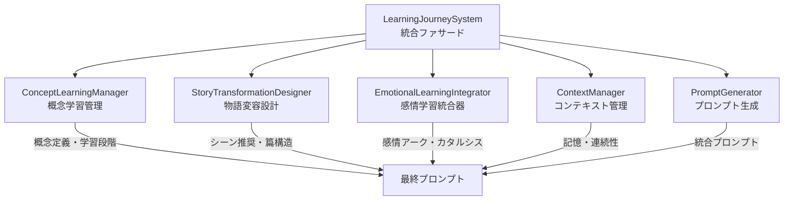

# 学習旅程システム統合の完全解析

## システム概要

**LearningJourneySystem**は「魂のこもった学びの物語」を実現するための統合システムで、**5つの主要コンポーネント**が連携してプロンプトに学習要素を統合します。

## アーキテクチャ構成



---

## 統合フロー詳細解析

### 1. システム初期化プロセス

**ファイル:** `paste-11.ts` (LearningJourneySystem)  
**メソッド:** `initialize(storyId: string)`

```typescript
// Line 85-155
async initialize(storyId: string): Promise<void> {
    // 各コンポーネントを並列初期化
    const initPromises = [
        this.conceptManager.initialize(),        // 概念ライブラリ読み込み
        this.storyDesigner.initialize(),         // 篇構造設計
        this.promptGenerator.initialize(),       // プロンプト生成器
        this.contextManager.initialize(storyId)  // コンテキスト管理
    ];
}
```

**初期化内容:**
1. **ConceptLearningManager:** ビジネス概念（ISSUE DRIVEN等）の定義読み込み
2. **StoryTransformationDesigner:** 初期篇構造（覚醒・探求・変容）生成
3. **ContextManager:** 記憶階層からコンテキスト状態読み込み
4. **EmotionalLearningIntegrator:** 感情分析エンジン準備

---

### 2. 章プロンプト生成プロセス

**ファイル:** `paste-11.ts`  
**メソッド:** `generateChapterPrompt(chapterNumber: number)`

#### **フェーズ1: 情報収集**

```typescript
// Line 190-240
// 1. コンテキストを取得
const context = this.contextManager.getContext();

// 2. 章が属する篇を取得
const section = this.storyDesigner.getSectionByChapter(chapterNumber);

// 3. 概念と学習段階を取得
const conceptName = section?.mainConcept || context.mainConcept;
const learningStage = await this.conceptManager.determineLearningStage(
    conceptName, chapterNumber
);
```

**取得される情報:**
- **概念名:** "ISSUE DRIVEN"
- **学習段階:** MISCONCEPTION → EXPLORATION → CONFLICT → INSIGHT → APPLICATION → INTEGRATION
- **篇情報:** 覚醒（1-5章）、探求（6-10章）、変容（11-15章）

#### **フェーズ2: 学習要素生成**

```typescript
// 4. シーン推奨を生成
const sceneRecommendations = await this.storyDesigner.generateSceneRecommendations(
    conceptName, learningStage, chapterNumber
);

// 5. 感情学習設計を生成
const emotionalArc = await this.emotionalIntegrator.designEmotionalArc(
    conceptName, learningStage, chapterNumber
);

// 6. カタルシス体験を生成
const catharticExperience = await this.emotionalIntegrator.designCatharticExperience(
    conceptName, learningStage, chapterNumber
);

// 7. 共感ポイントを生成
const empatheticPoints = await this.emotionalIntegrator.generateEmpatheticPoints(
    '', conceptName, learningStage
);
```

---

### 3. ConceptLearningManager 統合詳細

**ファイル:** `paste-8.ts`

#### **概念定義データ構造**

```typescript
interface BusinessConcept {
    name: string;                    // "ISSUE DRIVEN"
    description: string;             // 概念説明
    keyPrinciples: string[];         // 主要原則
    commonMisconceptions: string[];  // 一般的な誤解
    learningJourney: {               // 学習段階別説明
        [LearningStage.MISCONCEPTION]: "製品や技術起点の思考から...",
        [LearningStage.EXPLORATION]: "顧客視点の重要性に気づき始め...",
        [LearningStage.CONFLICT]: "顧客の言葉をそのまま受け取ることの限界...",
        [LearningStage.INSIGHT]: "顧客の本質的な課題を見極めることの重要性...",
        [LearningStage.APPLICATION]: "本質的な問いを通じて顧客との対話...",
        [LearningStage.INTEGRATION]: "課題起点のアプローチが自然な思考習慣..."
    }
}
```

#### **体現化プラン生成**
**メソッド:** `getEmbodimentPlan(conceptName, chapterNumber)`

```typescript
// Line 560-600: 学習段階に応じた体現化計画
switch (currentStage) {
    case LearningStage.MISCONCEPTION:
        return {
            expressionMethods: [
                "誤解に基づく行動とその限界の描写",
                "概念の部分的・表面的理解の表現"
            ],
            keyElements: [
                "誤解や思い込みの明確な描写",
                "誤った前提に基づく判断"
            ],
            dialogueSuggestions: [
                "これが唯一の正しい方法だ、他のやり方は考える必要もない"
            ],
            tensionRecommendation: {
                recommendedTension: 0.6,
                reason: "誤解段階では、キャラクターが概念の限界に直面し始める緊張感を表現"
            }
        };
}
```

**プロンプトへの流し込み先:**
- **【学びの物語ガイダンス】セクション**
- **対話例・内面描写の指示**
- **テンション調整指示**

---

### 4. EmotionalLearningIntegrator 統合詳細

**ファイル:** `paste-9.ts`

#### **感情アーク設計**
**メソッド:** `designEmotionalArc(conceptName, stage, chapterNumber)`

```typescript
// Line 82-90: 学習段階別感情設計
case LearningStage.CONFLICT:
    return {
        recommendedTone: "葛藤と決断の緊張感",
        emotionalJourney: {
            opening: [
                { dimension: "葛藤", level: 7 },
                { dimension: "混乱", level: 6 }
            ],
            development: [
                { dimension: "内的対立", level: 8 },
                { dimension: "緊張", level: 7 }
            ],
            conclusion: [
                { dimension: "決断", level: 8 },
                { dimension: "覚悟", level: 7 }
            ]
        },
        reason: "葛藤段階では、相反する視点の対立から決断へと向かう緊張感のある感情の流れを表現"
    };
```

#### **カタルシス体験設計**
**メソッド:** `designCatharticExperience(conceptName, stage, chapterNumber)`

```typescript
// Line 184-220: 段階別カタルシス体験
case LearningStage.INSIGHT:
    return {
        type: 'intellectual',
        intensity: 0.9,
        trigger: `${conceptName}の核心に触れる瞬間`,
        buildup: [
            '概念の限界に直面して混乱する',
            '新たな視点の可能性を垣間見る'
        ],
        peakMoment: `突如として、${conceptName}の本質が明確に見え、すべてが繋がる瞬間の感動。`,
        aftermath: `${conceptName}に対する理解が一変し、新たな視点で物事を見られるようになる。`
    };
```

#### **共感ポイント生成**
**メソッド:** `generateEmpatheticPoints(chapterContent, conceptName, stage)`

```typescript
// Line 547-580: AIによる共感ポイント抽出
const prompt = `
読者が共感しやすい瞬間を5つ抽出し、以下の情報を提供してください：
1. タイプ: character（キャラクターの内面）、situation（状況）、decision（決断）、realization（気づき）、transformation（変容）
2. 位置: 章内での相対位置（0-1の数値）
3. 強度: 共感の強さ（0-1の数値）
4. 説明: 共感ポイントの簡潔な説明
`;
```

**プロンプトへの流し込み先:**
- **【感情アークの設計】セクション**
- **【カタルシス体験】セクション**
- **【共感ポイント】セクション**

---

### 5. StoryTransformationDesigner 統合詳細

**ファイル:** `paste-13.ts`

#### **篇構造定義**
**メソッド:** `generateInitialSections()`

```typescript
// Line 65-105: 初期篇構造
const initialSections: Section[] = [
    {
        id: 'section-1',
        title: '覚醒',
        theme: '起業の原点と初期の挑戦',
        mainConcept: 'ISSUE DRIVEN',
        startChapter: 1, endChapter: 5,
        learningGoal: '課題起点思考の基礎を理解する',
        transformationGoal: '自己中心から顧客中心への視点転換',
        emotionalGoal: '混乱から好奇心への感情的変化'
    },
    // section-2: 探求（6-10章）
    // section-3: 変容（11-15章）
];
```

#### **シーン推奨生成**
**メソッド:** `generateSceneRecommendations(conceptName, stage, chapterNumber)`

```typescript
// Line 196-250: 学習段階別シーンパターン
private getStageSpecificScenePattern(stage: LearningStage) {
    switch (stage) {
        case LearningStage.MISCONCEPTION:
            return {
                sceneType: 'PROBLEM_DEMONSTRATION',
                scenePattern: '問題実証パターン',
                keyElements: [
                    '誤解に基づく行動とその結果',
                    '既存パラダイムの限界を示す要素'
                ]
            };
        case LearningStage.INSIGHT:
            return {
                sceneType: 'REALIZATION',
                scenePattern: '閃きパターン',
                keyElements: [
                    '気づきの瞬間',
                    '視界が広がる体験'
                ]
            };
    }
}
```

**プロンプトへの流し込み先:**
- **【シーン設計】セクション**
- **【篇テーマ】反映指示**
- **【変容目標】指示**

---

## プロンプト統合プロセス

### **PromptGenerator での統合**

**ファイル:** `paste-6.ts`  
**メソッド:** `enrichContextWithLearningJourney(context)`

```typescript
// Line 845-910: コンテキスト拡張
const enrichedContext = { ...context };

// メイン概念を取得
const mainConcept = await this.getMainConcept(context);

// 学習段階を判断
const learningStage = await this.learningJourneySystem.concept.determineLearningStage(
    mainConcept, chapterNumber
);

// 体現化プランを取得
const embodimentPlan = await this.learningJourneySystem.concept.getEmbodimentPlan(
    mainConcept, chapterNumber
);

// 感情アーク設計を取得
const emotionalArc = await this.learningJourneySystem.emotion.designEmotionalArc(
    mainConcept, learningStage, chapterNumber
);

// コンテキストに学習旅程情報を追加
enrichedContext.learningJourney = {
    mainConcept,
    learningStage,
    embodimentPlan,
    emotionalArc,
    catharticExperience,
    sceneRecommendations,
    empatheticPoints
};
```

### **integratePrompts での最終統合**

**メソッド:** `integratePrompts(prompt, enrichedContext)`

```typescript
// Line 968-1006: プロンプト統合
if (context.chapterNumber === 1) {
    // 第1章は基本プロンプトをベースにし、学習要素を追加
    const learningSection = `
## 学びの物語ガイダンス
・概念: ${conceptName}
・学習段階: ${learningStage}

### 体現化ガイド
${embodimentGuide}

## 共感ポイント
${empatheticPoints}

## 重要な執筆ガイドライン
1. **変容と成長**: キャラクターの内面変化を通して読者に共感体験を提供する
2. **体験的学習**: 概念を説明するのではなく、キャラクターの体験を通して読者が自然と学べるようにする
3. **感情の旅**: 指定された感情アークに沿って読者を感情的な旅に連れていく
4. **共感ポイント**: 指定された共感ポイントを効果的に描写し、読者の感情移入を促す
5. **カタルシス**: 学びと感情が統合された瞬間を印象的に描く
    `;
} else {
    // 第2章以降は学習旅程プロンプトをベースに必要なセクションを追加
    integratedPrompt = learningJourneyPrompt;
}
```

---

## 最終プロンプトでの出力位置

### **【学びの物語ガイダンス】セクション**
```
・概念: ISSUE DRIVEN
・学習段階: 誤解段階

### 体現化ガイド
・表現方法: 誤解に基づく行動とその限界の描写、概念の部分的・表面的理解の表現
・重要要素: 誤解や思い込みの明確な描写、誤った前提に基づく判断
・対話例: これが唯一の正しい方法だ、他のやり方は考える必要もない

### 感情アーク
・トーン: フラストレーションと混乱のバランス
・感情変化: 始まり（自信(7)、期待(6)）→ 展開（混乱(7)、フラストレーション(8)）→ 結末（自己疑問(6)、不安(5)）

### カタルシス体験
・タイプ: 知的カタルシス
・トリガー: ISSUE DRIVENの核心に触れる瞬間
・ピーク瞬間: 突如として、ISSUE DRIVENの本質が明確に見え、すべてが繋がる瞬間の感動

## 共感ポイント
・自信過剰な判断が裏目に出た瞬間の当惑（強度: 7/10）
・誤った前提で行動した結果の失敗（強度: 6/10）
・何かが根本的に間違っているという気づきの芽生え（強度: 5/10）

## シーン推奨
・問題実証パターンを含めてください（概念「ISSUE DRIVEN」の誤解を効果的に表現するため）
・以下の要素を含めてください: 誤解に基づく行動とその結果、既存パラダイムの限界を示す要素（誤解段階の重要な要素を確実に含めるため）
```

### **【重要な執筆ガイドライン】セクション**
```
1. **変容と成長**: キャラクターの内面変化を通して読者に共感体験を提供する
2. **体験的学習**: 概念を説明するのではなく、キャラクターの体験を通して読者が自然と学べるようにする
3. **感情の旅**: 指定された感情アークに沿って読者を感情的な旅に連れていく
4. **共感ポイント**: 指定された共感ポイントを効果的に描写し、読者の感情移入を促す
5. **カタルシス**: 学びと感情が統合された瞬間を印象的に描く
6. **自然な対話**: 教科書的な説明ではなく、自然な対話と内面描写で概念を表現する
7. **具体的な場面**: 抽象的な概念を具体的なビジネスシーンで表現する
```

---

## 章後処理による学習進捗更新

### **processChapterContent メソッド**

**ファイル:** `paste-11.ts`  
**メソッド:** `processChapterContent(chapterNumber, content, title)`

```typescript
// Line 315-380: 章内容分析と学習進捗更新
// 1. 章内容から概念体現化と学習段階を分析
const embodimentAnalysis = await this.conceptManager.analyzeConceptEmbodiment(
    conceptName, content, chapterNumber
);

// 2. 学習記録を更新
await this.conceptManager.updateConceptWithLearningRecord(
    conceptName, {
        stage: embodimentAnalysis.stage,
        chapterNumber: chapterNumber,
        insights: embodimentAnalysis.examples
    }
);

// 3. 感情分析を実行
const emotionAnalysis = await this.emotionalIntegrator.analyzeChapterEmotion(
    content, 'business'
);

// 4. 感情と学習の同期度を分析
const syncMetrics = await this.emotionalIntegrator.analyzeSynchronization(
    content, conceptName, embodimentAnalysis.stage
);
```

この処理により、生成された章の内容が**次の章のプロンプト生成にフィードバック**され、**学習段階が動的に進展**します。

---

## データフロー全体図

```
ConceptLearningManager
├── BusinessConcept定義 → 【学びの物語ガイダンス】.概念
├── LearningStage判定 → 【学びの物語ガイダンス】.学習段階  
├── EmbodimentPlan → 【学びの物語ガイダンス】.体現化ガイド
└── DialogueSuggestions → 対話例・内面描写指示

EmotionalLearningIntegrator  
├── EmotionalArc → 【学びの物語ガイダンス】.感情アーク
├── CatharticExperience → 【学びの物語ガイダンス】.カタルシス体験
├── EmpatheticPoints → 【学びの物語ガイダンス】.共感ポイント
└── SyncMetrics → 執筆品質評価

StoryTransformationDesigner
├── Section構造 → 【篇テーマ】反映指示
├── SceneRecommendations → 【学びの物語ガイダンス】.シーン推奨
└── TensionCurve → テンション調整指示

ContextManager
├── StoryContext → 物語状態管理
├── RecentChapters → 連続性確保
└── CharacterMemory → キャラクター記憶

PromptGenerator  
├── 基本プロンプト構築
├── 学習旅程統合
└── 最終出力フォーマット
```

---

## まとめ

**LearningJourneySystem**は単なる付加機能ではなく、**プロンプト生成の中核**を担っています。

### **統合の深度**
- **20種類以上のデータポイント**が学習旅程から提供
- **6つの専門セクション**に情報が分散配置
- **動的フィードバックループ**により章ごとに学習進捗が更新

### **教育効果の実現**
- **概念の段階的理解**（誤解→探索→葛藤→気づき→応用→統合）
- **感情と学習の同期**（カタルシス体験、共感ポイント）
- **物語構造との調和**（篇テーマ、シーン設計）

このシステムにより、従来の「情報提供型小説」から**「体験型学習物語」**への進化が実現されています。