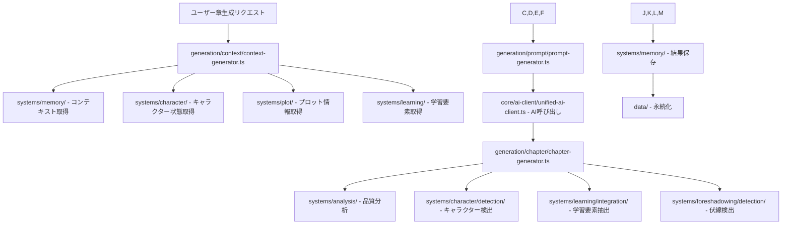

# 🚀 AI小説生成システム Version2 - AI一元化＋データフロー完全版ディレクトリ構造

## 🎯 設計理念

### AI呼び出し一元化の原則
- 🔄 **統一AIクライアント**: 全AI呼び出しを`core/ai-client/`で一元管理
- 📊 **バッチ処理**: 複数分析を一度のAI呼び出しで効率化
- 💾 **キャッシュ戦略**: 重複呼び出しの完全排除
- 📈 **コスト最適化**: 使用量監視とレート制限管理

### データフロー明確化の原則
- 🏭 **AI出力箇所**: どこでAIからの結果が必要か
- ⚙️ **アルゴリズム箇所**: どこでシステム計算が必要か
- 💾 **保存箇所**: どこで何を保存するか
- 🔄 **取得タイミング**: いつ、どこから、何を取得するか

---

## 📁 完全ディレクトリ構造

```
src/
├── app/                           # Next.js App Router
├── core/                          # システム制御層
│   ├── container/                 # サービスコンテナ・DI
│   ├── lifecycle/                 # 初期化・ライフサイクル管理
│   └── ai-client/                 # 🔥 統一AI呼び出し管理
├── systems/                       # 専門システム群（独立進化）
│   ├── memory/                    # 記憶階層システム
│   ├── character/                 # キャラクター管理システム
│   ├── learning/                  # 学習旅程システム
│   ├── plot/                      # プロット管理システム
│   ├── theme/                     # テーマ管理システム
│   ├── world/                     # 世界観設定システム
│   ├── genre/                     # ジャンル管理システム
│   ├── analysis/                  # 分析システム
│   ├── expression/                # 表現提案システム
│   ├── rules/                     # ルール管理システム
│   ├── foreshadowing/             # 伏線管理システム
│   ├── configuration/             # システム設定・パラメータ管理
│   └── ml-training/               # ML/DL学習用データ収集・蓄積
├── generation/                    # 生成制御層
│   ├── context/                   # コンテキスト生成
│   ├── prompt/                    # プロンプト生成
│   └── chapter/                   # チャプター生成
├── components/                    # UIコンポーネント
├── config/                        # 静的設定ファイル
├── types/                         # TypeScript型定義
└── utils/                         # 全システム共通ユーティリティ
```

---

## 🔥 core/ai-client/ - 統一AI呼び出し管理

### 📂 詳細構造
```
core/ai-client/
├── index.ts                       # 公開インターフェース
├── unified-ai-client.ts           # 🎯 メイン統一クライアント
├── request-processor.ts           # リクエスト処理エンジン
├── batch-processor.ts             # バッチ処理エンジン
├── cache-manager.ts               # インテリジェントキャッシュ
├── rate-limiter.ts                # レート制限・優先度管理
├── cost-optimizer.ts              # コスト最適化
├── usage-monitor.ts               # 使用量監視・分析
├── prompt-optimizer.ts            # プロンプト最適化
├── response-formatter.ts          # レスポンス統一フォーマット
├── error-handler.ts               # エラーハンドリング
├── interfaces.ts                  # AI統合インターフェース
└── types.ts                       # AI統合型定義
```

### 🎯 AI呼び出しが必要な箇所の完全マッピング

#### 1. 章生成（メイン生成）
```typescript
// generation/chapter/chapter-generator.ts
export class ChapterGenerator {
  🔥 AI呼び出し: generateChapter(prompt: EnhancedPrompt): Promise<GeneratedChapter>
  📊 アルゴリズム: validateChapterStructure(), enhanceChapterElements()
  💾 保存: chapters/{chapterNumber}.json
  🔄 取得タイミング: ユーザー生成リクエスト時
}
```

#### 2. 品質分析（統合分析）
```typescript
// systems/analysis/core/analysis-engine.ts
export class AnalysisEngine {
  🔥 AI呼び出し: analyzeContent(content: string, analysisTypes: AnalysisType[]): Promise<AnalysisResults>
  📊 アルゴリズム: calculateQualityScore(), compareWithStandards()
  💾 保存: data/mid-term-memory/analysis-results.json
  🔄 取得タイミング: 章生成完了後、品質チェック時
}

// 統合される分析タイプ
- CHARACTER_ANALYSIS: キャラクター一貫性分析
- NARRATIVE_STRUCTURE: 物語構造分析
- STYLE_EVALUATION: 文体評価
- EMOTIONAL_IMPACT: 感情インパクト測定
- LEARNING_EFFECTIVENESS: 学習効果評価
```

#### 3. キャラクター検出・分析
```typescript
// systems/character/detection/character-detector.ts
export class CharacterDetector {
  🔥 AI呼び出し: detectCharactersInContent(content: string): Promise<DetectedCharacter[]>
  📊 アルゴリズム: mapToExistingCharacters(), calculateRelevanceScore()
  💾 保存: data/short-term/character-detections.json
  🔄 取得タイミング: 章生成完了直後
}
```

#### 4. 学習要素抽出・統合
```typescript
// systems/learning/integration/learning-extractor.ts
export class LearningExtractor {
  🔥 AI呼び出し: extractLearningElements(content: string, frameworks: Framework[]): Promise<LearningElements>
  📊 アルゴリズム: matchFrameworkPatterns(), calculateLearningDepth()
  💾 保存: data/mid-term-memory/learning-progression.json
  🔄 取得タイミング: 章分析時、学習進捗更新時
}
```

#### 5. 伏線検出・提案
```typescript
// systems/foreshadowing/detection/foreshadowing-detector.ts
export class ForeshadowingDetector {
  🔥 AI呼び出し: detectForeshadowingElements(content: string): Promise<ForeshadowingElements>
  📊 アルゴリズム: calculatePlantingOpportunities(), optimizeTiming()
  💾 保存: data/long-term-memory/foreshadowing-tracking.json
  🔄 取得タイミング: 章生成完了後、伏線計画更新時
}
```

#### 6. 表現改善提案
```typescript
// systems/expression/enhancement/expression-enhancer.ts
export class ExpressionEnhancer {
  🔥 AI呼び出し: generateExpressionSuggestions(content: string, context: ExpressionContext): Promise<ExpressionSuggestions>
  📊 アルゴリズム: detectRepetition(), calculateVarietyScore()
  💾 保存: data/short-term/expression-suggestions.json
  🔄 取得タイミング: 品質分析時、表現改善リクエスト時
}
```

---

## 🎯 統一AIクライアントの詳細設計

### unified-ai-client.ts
```typescript
export interface IUnifiedAIClient {
  // 🎯 メイン生成
  generateChapter(request: ChapterGenerationRequest): Promise<GeneratedChapter>
  
  // 📊 統合分析（バッチ処理）
  analyzeContent(request: ContentAnalysisRequest): Promise<AnalysisResults>
  
  // 🔍 検出・抽出（バッチ処理）
  detectAndExtract(request: DetectionExtractionRequest): Promise<DetectionResults>
  
  // ✨ 改善提案
  generateImprovements(request: ImprovementRequest): Promise<ImprovementSuggestions>
  
  // 📈 使用状況管理
  getUsageStatistics(): UsageStatistics
  getCostEstimate(request: AIRequest): CostEstimate
}

export class UnifiedAIClient implements IUnifiedAIClient {
  // 🎯 パブリックメソッド
  + generateChapter(request: ChapterGenerationRequest): Promise<GeneratedChapter>
  + analyzeContent(request: ContentAnalysisRequest): Promise<AnalysisResults>
  + detectAndExtract(request: DetectionExtractionRequest): Promise<DetectionResults>
  + generateImprovements(request: ImprovementRequest): Promise<ImprovementSuggestions>
  + batchProcess(requests: AIRequest[]): Promise<AIResponse[]>
  + getUsageStatistics(): UsageStatistics
  + getCostEstimate(request: AIRequest): CostEstimate
  + clearCache(): void
  + setRateLimit(limit: RateLimit): void
  
  // 🔧 プライベートメソッド
  - processRequest<T>(request: AIRequest): Promise<T>
  - optimizePrompt(prompt: string, context: OptimizationContext): OptimizedPrompt
  - applyRateLimit(request: AIRequest): Promise<void>
  - cacheResults(request: AIRequest, response: AIResponse): void
  - getCachedResult(request: AIRequest): AIResponse | null
  - validateRequest(request: AIRequest): ValidationResult
  - formatResponse<T>(rawResponse: RawAIResponse, expectedType: ResponseType): T
  - handleAPIError(error: APIError): never
  - logAPIUsage(request: AIRequest, response: AIResponse): void
  
  // 🛠️ ヘルパーメソッド
  - calculateTokenCount(text: string): number
  - estimateCost(request: AIRequest): number
  - createCacheKey(request: AIRequest): string
  - updateStatistics(usage: UsageData): void
  - shouldUseCache(request: AIRequest): boolean
}
```

### バッチ処理による効率化
```typescript
// batch-processor.ts
export class BatchProcessor {
  // 複数の分析を一度のAI呼び出しで実行
  + processBatch(requests: AIRequest[]): Promise<BatchResults>
  
  // バッチ最適化
  - groupSimilarRequests(requests: AIRequest[]): RequestGroup[]
  - optimizeBatchSize(requests: AIRequest[]): OptimizedBatch[]
  - combinePrompts(requests: AIRequest[]): CombinedPrompt
  - distributeBatchResults(batchResponse: BatchResponse): IndividualResults[]
}
```

---

## 📊 データフロー完全マップ

### 🔄 章生成データフロー



### 💾 データ保存戦略

#### 短期記憶（72時間以内）
```
data/short-term/
├── chapters/                      # 最新3章分
│   ├── chapter-{N}.json           # 章コンテンツ
│   └── chapter-{N}-metadata.json  # 章メタデータ
├── generation-cache.json          # 生成キャッシュ
├── character-detections.json      # キャラクター検出結果
├── expression-suggestions.json    # 表現改善提案
└── immediate-context.json         # 即座コンテキスト
```

#### 中期記憶（篇単位）
```
data/mid-term-memory/
├── analysis-results.json          # 品質分析結果
├── character-evolution.json       # キャラクター進化
├── learning-progression.json      # 学習進捗
├── narrative-progression.json     # 物語進行
└── quality-metrics.json          # 品質メトリクス
```

#### 長期記憶（永続）
```
data/long-term-memory/
├── character-database.json        # キャラクター完全データ
├── framework-database.json        # フレームワークDB
├── foreshadowing-tracking.json    # 伏線追跡
├── world-knowledge.json           # 世界知識
└── system-knowledge.json          # システム知識
```

### 🔄 データ取得タイミング

#### 1. 章生成時
```typescript
// データ取得順序
1. systems/memory/short-term/ → 直近3章のコンテキスト
2. systems/character/ → アクティブキャラクター状態
3. systems/plot/ → 現在章のプロット指示
4. systems/learning/ → 進行中学習要素
5. systems/world/ → 世界設定
6. systems/theme/ → テーマ設定
```

#### 2. 分析時
```typescript
// バッチ分析実行
1. core/ai-client/ → 統合分析AI呼び出し
2. systems/analysis/ → 品質スコア計算
3. systems/character/detection/ → キャラクター検出
4. systems/learning/integration/ → 学習要素抽出
5. systems/foreshadowing/detection/ → 伏線要素検出
```

#### 3. 結果保存時
```typescript
// 階層別保存
1. data/short-term/ → 即座利用データ
2. data/mid-term-memory/ → 分析結果・進捗
3. data/long-term-memory/ → 永続知識・設定
```

---

## ⚙️ アルゴリズム処理箇所

### 📊 純アルゴリズム（AI不要）

#### 1. キャラクター管理
```typescript
// systems/character/core/character-calculator.ts
+ calculateMBTICompatibility() - MBTI統計ベース計算
+ predictGrowthTrajectory() - 成長軌道予測
+ analyzeRelationshipDynamics() - 関係性力学分析
+ calculateSkillProficiency() - スキル習熟度計算
```

#### 2. 学習旅程管理
```typescript
// systems/learning/progress/progress-calculator.ts
+ calculateLearningProgress() - 学習進捗計算
+ determineLearningStage() - 学習段階判定
+ optimizeLearningPath() - 学習経路最適化
+ assessFrameworkMastery() - フレームワーク習得度評価
```

#### 3. プロット管理
```typescript
// systems/plot/analysis/plot-analyzer.ts
+ validatePlotConsistency() - プロット一貫性検証
+ calculateTensionCurve() - テンション曲線計算
+ assessPhaseProgression() - フェーズ進行評価
+ optimizePlotTiming() - プロットタイミング最適化
```

#### 4. 記憶階層管理
```typescript
// systems/memory/integration/memory-optimizer.ts
+ optimizeMemoryDistribution() - メモリ分散最適化
+ calculateDataImportance() - データ重要度計算
+ scheduleMemoryPromotion() - メモリ昇格スケジューリング
+ resolveMemoryDuplicates() - メモリ重複解決
```

### 🤖 AI補助アルゴリズム

#### 1. プロンプト最適化
```typescript
// core/ai-client/prompt-optimizer.ts
+ optimizePromptLength() - プロンプト長最適化
+ enhancePromptClarity() - プロンプト明確性向上
+ adaptPromptForModel() - モデル適応最適化
+ calculatePromptEffectiveness() - プロンプト効果計算
```

#### 2. キャッシュ管理
```typescript
// core/ai-client/cache-manager.ts
+ calculateCacheRelevance() - キャッシュ関連性計算
+ optimizeCacheEviction() - キャッシュ排除最適化
+ analyzeCacheHitRate() - キャッシュヒット率分析
+ predictCacheUtility() - キャッシュ有用性予測
```

---

## 🏗️ システム間通信アーキテクチャ

### 🔄 イベントバス設計
```typescript
// core/communication/event-bus.ts
export class EventBus {
  // イベント発行
  + emit(event: SystemEvent): void
  + emitAsync(event: SystemEvent): Promise<void>
  
  // イベント購読
  + subscribe(eventType: EventType, handler: EventHandler): void
  + unsubscribe(eventType: EventType, handler: EventHandler): void
  
  // バッチイベント
  + emitBatch(events: SystemEvent[]): void
  + subscribeMultiple(subscriptions: Subscription[]): void
}

// イベント種類
interface SystemEvent {
  type: 'CHAPTER_GENERATED' | 'ANALYSIS_COMPLETED' | 'CHARACTER_UPDATED' | 'LEARNING_PROGRESSED'
  payload: EventPayload
  source: SystemName
  timestamp: Date
}
```

### 📡 システム間データ交換

#### 1. 章生成完了イベント
```typescript
event: 'CHAPTER_GENERATED'
payload: {
  chapterNumber: number
  content: string
  metadata: ChapterMetadata
}
subscribers: [
  'systems/analysis/',      // 品質分析開始
  'systems/character/',     // キャラクター検出開始
  'systems/learning/',      // 学習要素抽出開始
  'systems/foreshadowing/', // 伏線検出開始
  'systems/memory/'         // メモリ保存開始
]
```

#### 2. 分析完了イベント
```typescript
event: 'ANALYSIS_COMPLETED'
payload: {
  chapterNumber: number
  analysisResults: AnalysisResults
  qualityScore: number
}
subscribers: [
  'systems/memory/',        // 分析結果保存
  'systems/ml-training/',   // ML学習データ保存
  'components/admin/'       // UI更新
]
```

---

## 🔧 型定義完全構造

### 📂 types/ 詳細構造
```
types/
├── index.ts                       # 型定義エクスポート
├── common/                        # 共通型
│   ├── base.ts                    # 基底型・ID型・タイムスタンプ型
│   ├── result.ts                  # 結果型・エラー型
│   ├── event.ts                   # イベント型
│   └── status.ts                  # ステータス型
├── ai-client/                     # AI統合型
│   ├── request.ts                 # AIリクエスト型
│   ├── response.ts                # AIレスポンス型
│   ├── batch.ts                   # バッチ処理型
│   └── usage.ts                   # 使用量型
├── systems/                       # システム別型
│   ├── memory.ts                  # メモリシステム型
│   ├── character.ts               # キャラクターシステム型
│   ├── learning.ts                # 学習システム型
│   ├── plot.ts                    # プロットシステム型
│   ├── theme.ts                   # テーマシステム型
│   ├── world.ts                   # 世界システム型
│   ├── genre.ts                   # ジャンルシステム型
│   ├── analysis.ts                # 分析システム型
│   ├── expression.ts              # 表現システム型
│   ├── rules.ts                   # ルールシステム型
│   ├── foreshadowing.ts           # 伏線システム型
│   ├── configuration.ts           # 設定システム型
│   └── ml-training.ts             # ML訓練システム型
├── generation/                    # 生成関連型
│   ├── context.ts                 # コンテキスト型
│   ├── prompt.ts                  # プロンプト型
│   └── chapter.ts                 # チャプター型
└── integration/                   # システム統合型
    ├── communication.ts           # 通信型
    ├── data-flow.ts              # データフロー型
    └── batch-processing.ts        # バッチ処理型
```

### 🎯 重要型定義

#### AI統合型
```typescript
// types/ai-client/request.ts
export interface AIRequest {
  id: string
  type: 'GENERATION' | 'ANALYSIS' | 'DETECTION' | 'IMPROVEMENT'
  prompt: string
  context: RequestContext
  priority: 'LOW' | 'MEDIUM' | 'HIGH' | 'CRITICAL'
  maxTokens?: number
  temperature?: number
  cacheKey?: string
}

// types/ai-client/batch.ts
export interface BatchRequest {
  requests: AIRequest[]
  batchId: string
  optimizationStrategy: 'SPEED' | 'COST' | 'QUALITY'
  maxConcurrency: number
}
```

#### データフロー型
```typescript
// types/integration/data-flow.ts
export interface DataFlow {
  source: SystemName
  destination: SystemName
  dataType: DataType
  trigger: TriggerCondition
  transformation?: TransformationRule
  persistence?: PersistenceConfig
}

export interface SystemDataRequest {
  requestId: string
  requestingSystem: SystemName
  targetSystems: SystemName[]
  dataQuery: DataQuery
  urgency: 'IMMEDIATE' | 'SCHEDULED' | 'BACKGROUND'
}
```

---

## 🔄 実装優先度とフェーズ

### Phase 1: 基盤システム（1-2週間）
1. **core/ai-client/** - 統一AIクライアント実装
2. **core/container/** - サービスコンテナ実装
3. **core/communication/** - イベントバス実装
4. **types/** - 型定義完成

### Phase 2: データフロー（3-4週間）
1. **systems/memory/** - データフロー統合
2. **generation/context/** - コンテキスト統合
3. **generation/prompt/** - プロンプト統合
4. **バッチ処理** - AI呼び出し最適化

### Phase 3: システム統合（5-8週間）
1. **12専門システム** - 順次統合
2. **イベントバス連携** - システム間通信
3. **データ永続化** - 階層別保存
4. **統合テスト** - エンドツーエンド検証

### Phase 4: 最適化（9-10週間）
1. **パフォーマンス最適化**
2. **コスト効率化**
3. **品質保証**
4. **運用監視**

この設計により、**AI呼び出しの完全一元化**と**データフローの明確化**が実現され、効率的で保守性の高いシステムが構築できます。